# School Project - Providing Networks and Services

<br />
 <div align="center">
  <a href="https://github.com/noahzmr/provide-networks-and-services">
    
  </a>

  <h3 align="center">School Project - Providing Networks and Services</h3>

  <p align="center">
    Dive into the world of networks and services.
    <br />
    <a href="https://github.com/noahzmr/provide-networks-and-services"><strong>Explore the docs »</strong></a>
    <br />
    <br />
    <a href="https://github.com/noahzmr/provide-networks-and-services/issues">Report Bug</a>
    ·
    <a href="https://github.com/noahzmr/provide-networks-and-services/discussions">Request Feature</a>
  </p>
</div>

<details>
  <summary>Table of Contents</summary>
    <ol>
      <li><a href="#introduction">Introduction</a>
        <ul>
          <li><a href="#built-with">Built With</a></li>
        </ul>
      </li>
      <li><a href="#basic-scenario">Basic scenario</a>
        <ul>
          <li><a href="#the-company">The company</a></li>
          <li><a href="#design-and-implementation-of-site-networking">Design and implementation of site networking</a></li>
          <li><a href="#requirements-for-the-network">Requirements for the network</a></li>
          <li><a href="#requirements-for-securing-routers--switches">Requirements for securing routers & switches</a></li>
          <li><a href="#procedure-and-sub-steps-material-and-required-information">Procedure and sub-steps, material and required information</a>
            <ul>
              <li><a href="#organize-the-work-process">Organize the work process</a>
                <ul>
                  <li><a href="#tools">Tools</a></li>
                </ul>
              </li>
              <li><a href="#construction-of-the-physical-network">Construction of the "physical" network</a></li>
              <li><a href="#creation-of-the-ipv6-address-scheme">Creation of the IPv6 address scheme</a></li>
              <li><a href="#configuration-of-the-devices-and-services">Configuration of the devices and services</a></li>
              <li><a href="#extension-a-or-b">Extension A or B</a>
                <ul>
                  <li><a href="#extension-a">Extension A</a>
                    <ul>
                      <li><a href="#acl">ACL</a></li>
                      <li><a href="#dhcpv6">DHCPv6</a></li>
                      <li><a href="#ospfv3">OSPFv3</a></li>
                    </ul>
                  </li>
                  <li><a href="#extension-b">Extension B</a>
                    <ul>
                      <li><a href="#northbound">Northbound</a></li>
                      <li><a href="#southbound">Southbound</a></li>
                      <li><a href="#solution">Solution</a></li>
                    </ul>
                  </li>
                </ul>
              </li>
              <li><a href="#present-the-results-of-your-work">Present the results of your work</a></li>
            </ul>
          </li>
        </ul>
      </li>
      <li><a href="#cisco-packet-tracer">Cisco Packet Tracer</a>
        <ul>
          <li><a href="#ip-table">IP Table</a></li>
          <li><a href="#hamburg">Hamburg</a>
            <ul>
              <li><a href="#devices">Devices</a>
                <ul>
                  <li><a href="#clients">Clients</a>
                    <ul>
                      <li><a href="#hh-pc-01">HH-PC-01</a></li>
                      <li><a href="#hh-pc-02">HH-PC-02</a></li>
                    </ul>
                  </li>
                  <li><a href="#hh-sws-01">HH-SWS-01</a>
                    <ul>
                      <li><a href="#running-config">Running Config</a></li>
                    </ul>
                  </li>
                  <li><a href="#hh-rt-01">HH-RT-01</a>
                    <ul>
                      <li><a href="#running-config">Running Config</a></li>
                    </ul>
                  </li>
                </ul>
              </li>
              <li><a href="#connections">Connections</a></li>
              <li><a href="#vlan">VLAN</a></li>
            </ul>
          </li>
          <li><a href="#lübeck">Lübeck</a>
            <ul>
              <li><a href="#devices">Devices</a>
                <ul>
                  <li><a href="#clients">Clients</a>
                    <ul>
                      <li><a href="#hl-pc-01">HL-PC-01</a></li>
                      <li><a href="#hl-pc-02">HL-PC-02</a></li>
                    </ul>
                  </li>
                  <li><a href="#hl-sws-01">HL-SWS-01</a>
                    <ul>
                      <li><a href="#running-config">Running Config</a></li>
                    </ul>
                  </li>
                  <li><a href="#hl-rt-01">HL-RT-01</a>
                    <ul>
                      <li><a href="#running-config">Running Config</a></li>
                    </ul>
                  </li>
                </ul>
              </li>
              <li><a href="#connections">Connections</a></li>
              <li><a href="#vlan">VLAN</a></li>
            </ul>
          </li>
          <li><a href="#berlin">Berlin</a>
            <ul>
              <li><a href="#devices">Devices</a>
                <ul>
                  <li><a href="#clients">Clients</a>
                    <ul>
                      <li><a href="#b-srv-01">B-SRV-01</a></li>
                    </ul>
                  </li>
                  <li><a href="#b-sws-01">B-SWS-01</a>
                    <ul>
                      <li><a href="#running-config">Running Config</a></li>
                    </ul>
                  </li>
                  <li><a href="#b-rt-01">B-RT-01</a>
                    <ul>
                      <li><a href="#running-config">Running Config</a></li>
                    </ul>
                  </li>
                </ul>
              </li>
              <li><a href="#connections">Connections</a></li>
              <li><a href="#vlan">VLAN</a></li>
            </ul>
          </li>
          <li><a href="#münchen">München</a>
            <ul>
              <li><a href="#devices">Devices</a>
                <ul>
                  <li><a href="#clients">Clients</a>
                    <ul>
                      <li><a href="#m-srv-01">M-SRV-01</a></li>
                      <li><a href="#m-srv-02">M-SRV-02</a></li>
                    </ul>
                  </li>
                  <li><a href="#m-sws-01">M-SWS-01</a>
                    <ul>
                      <li><a href="#running-config">Running Config</a></li>
                    </ul>
                  </li>
                  <li><a href="#m-rt-01">M-RT-01</a>
                    <ul>
                      <li><a href="#running-config">Running Config</a></li>
                    </ul>
                  </li>
                </ul>
              </li>
              <li><a href="#connections">Connections</a></li>
              <li><a href="#vlan">VLAN</a></li>
            </ul>
          </li>
          <li><a href="#global">Global</a>
            <ul>
              <li><a href="#cable">Cable</a></li>
              <li><a href="#ipv6">IPv6</a></li>
            </ul>
          </li>
          <li><a href="#commands">Commands</a>
            <ul>
              <li><a href="#enable-ipv6">Enable IPv6</a></li>
              <li><a href="#give-a-interface-a-static-ip">Give a Interface a Static IP</a></li>
              <li><a href="#show-all-ipv6-address">Show all IPv6 Address</a></li>
              <li><a href="#vlan-with-ipv6-address-on-a-router">VLan with IPv6 address on a Router</a></li>
              <li><a href="#password-on-a-router">Password on a Router</a></li>
              <li><a href="#change-password">Change Password</a></li>
              <li><a href="#config-trunk-on-a-switch">Config trunk on a Switch</a></li>
              <li><a href="#create-a-banner">Create a Banner</a></li>
              <li><a href="#enable-ssh">Enable SSH</a></li>
              <li><a href="#dhcp-pool-connection-on-a-router">DHCP Pool connection on a Router</a></li>
              <li><a href="#enable-ospfv3">Enable OSPFv3</a></li>
            </ul>
          </li>
        </ul>
      </li>
      <li><a href="#keycloak">Keycloak</a>
        <ul>
          <li><a href="#what-is-keycloak">What is Keycloak?</a></li>
          <li><a href="#groups-and-roles">Groups and Roles</a></li>
        </ul>
      </li>
      <li><a href="#prometheus">Prometheus</a></li>
      <li><a href="#grafana">Grafana</a>
        <li><a href="#grafana#dashboard">Dashboard</a></li>
      </li>
      <li><a href="#sonarqube">SonarQube</a>
        <li><a href="#sonarqube#ui">UI</a></li>
        <li><a href="#sonarqube#backend">Backend</a></li>
      </li>
      <li><a href="#sentry">Sentry</a></li>
      <li><a href="#glossar">Glossar</a>
        <ul>
          <li><a href="#ipv6">IPv6</a></li>
          <li><a href="#unique-local-unicast-addresses">Unique Local Unicast addresses</a></li>
          <li><a href="#global-unicast-addresses">Global Unicast addresses</a></li>
          <li><a href="#provider-independent-address-space">Provider Independent Address Space</a></li>
          <li><a href="#vlan">VLAN</a></li>
          <li><a href="#trunk">Trunk</a></li>
          <li><a href="#prefix">Prefix</a></li>
          <li><a href="#l3-switches">L3 switches</a></li>
          <li><a href="#ssh">SSH</a></li>
          <li><a href="#kubernetes">Kubernetes</a></li>
          <li><a href="#terraform">Terraform</a></li>
          <li><a href="#vault-hashicorp">Vault Hashicorp</a></li>
        </ul>
      </li>
      <li><a href="#contact">Contact</a></li>
      <li><a href="#die-medocino">Die Medocino</a></li>
      <li><a href="#support">Support</a></li>
      <li><a href="#license">License</a></li>
    </ol>
</details>

# Introduction

We would like to welcome you to a fictitious scenario of the vocational school [ITECH Elbinsel Wilhelmsburg (BS14)](https://www.itech-bs14.de/startseite). In this scenario, we dive into the world of networks and services and imagine that we are part of an exciting school project with the topic "Providing Networks and Services".

As BS14 students, we have a unique opportunity to demonstrate our skills in planning, configuring and extending networks and services. This project is about planning, setting up and documenting an IPv6 network. We will look at various aspects of networks and services from different perspectives and deepen our knowledge in this area.

To further challenge us and expand our skills, there are two extensions we can do as part of this project. In extension A, the focus is on implementing OSPFv3, DHCPv6, and ACLs to extend our network. Through this extension we will be able to dive deeper into these topics and deepen our knowledge.

Extension B will allow us to explore the possibilities in software-defined networking (SDN). In doing so, we will explore how networks and services can be deployed and managed using this innovative technology. SDN opens up new avenues and perspectives for us to improve the efficiency and flexibility of networks.

We invite you to join us on our fictitious school project "Provisioning Networks and Services" at the ITECH Elbinsel Wilhelmsburg Vocational School (BS14). Dive with us into the world of networks and services and experience how we expand our knowledge and gain practical experience. We hope you enjoy reading this fictitious scenario and gain a lot of knowledge.

## Built With

[](https://www.netacad.com/courses/packet-tracer)
[](https://kubernetes.io/)
[](https://www.terraform.io/)
[](https://daringfireball.net/projects/markdown/)
[](https://www.vaultproject.io/)
[](https://mermaid-js.github.io/mermaid/)
[](https://react.dev/)
[](https://www.keycloak.org/)
[](https://axios-http.com/docs/intro)
[](https://expressjs.com/de/)
[](https://momentjs.com/)
[](https://eslint.org/)
[](https://prometheus.io/)
[](https://grafana.com/)

# Basic scenario

## The company

Streamline, headquartered in Hamburg, Germany, was founded in 2019 by managing directors Marius Jungbauer and André Kosmos. It is a medium-sized company that operates in the field of marketing streaming services. Currently, Streamline employs 120 people in different departments and locations.
An external service provider called B@ltic Networks was called in a few days ago to manage the IT infrastructure.
They are employees of the company B@ltic Networks and are specialized in the area of administration, configuration, maintenance and optimization of networks.
Designing and implementing network concepts according to individual customer requirements is a top priority in your company.

## Design and implementation of site networking

In addition to its headquarters in Hamburg, Streamline has three other locations: Lübeck, Berlin and Munich.
All four branches are networked. Only IPv4 with NAT is used.
However, this has led to many problems for a long time, which can only be circumvented by using various auxiliary protocols.

The management has now commissioned the company B@ltic Networks to redesign the site networking and implement it exclusively with IPv6.

Their team has been tasked with designing the concept and simulating it in a "demonstrator".

## Requirements for the network

- [x] Unique Local Unicast addresses should be used for the transport networks (connections of the routers among each other) (fd00..)
  - [x] IP addresses give
  - [x] tested
- [x] Global Unicast addresses are to be used for the site networks
  - [x] IP addresses give
  - [x] tested
- [x] The Provider Independent Address Space (PI space) 2001:db8:: /32 is available for the entire demo network
  - [x] Router
  - [x] Clients
  - [x] Server
  - [x] Switche
- [x] The configuration of static routes is intended to ensure the accessibility of the networks to each other
- [x] At each of the HH and HL sites, there are to be two networks separated by VLANs, each with its own global prefix.
  - [x] Vlans give
  - [x] tested
- [x] At sites B and M, there should be at least one VLAN each for the respective server with its own global prefix
  - [x] Vlans give
  - [x] tested
- [x] The site networks are set up using a router and L3 switches
- [x] Clients and servers receive global unicast addresses
  - [x] IP addresses give
  - [x] tested
- [x] The address assignment should initially be static

## Requirements for securing routers & switches

- [x] Create a banner
- [x] Setting passwords
- [x] Setting up the SSH accesses

## Procedure and sub-steps, material and required information

### Organize the work process

Then, before you start, organize your work! Look for tools, for example, to save something, to agree, to distribute tasks, etc. Make agreements about this with your group!

#### Tools

- [x] Cisco Paket Tracer
- [ ] Kubernetes
- [ ] Terraform
- [x] Mardown
- [ ] Vault Hashicorp
- [x] Prometheus
- [x] Grafana
- [x] Sentry

### Construction of the "physical" network

In Packet Tracer, create the demonstration station network with the components and connections that you can see in the following network sketch.
Be sure to select the correct components according to the specifications on the sketch.
You will notice that the routers must be equipped with additional serial ports. Corresponding plug-in modules are available for this purpose.


### Creation of the IPv6 address scheme

Before you configure any devices or interfaces, make a plan!
Think about how to divide the address space available to you according to the given PI space 2001:db8:: /32 in a sensible way.


### Configuration of the devices and services

Now it's time to configure the devices and services. Start with the routers.

- [x] First configure the basic configuration according to the requirements above, then configure the serial interfaces "between" the routers. Remember the descriptions on the interfaces.
- [x] Afterwards the switches etc.
- [x] Always carry out function tests in between

### Extension A or B

#### Extension A

The Streamline company would like to have limited access to various network services. Furthermore, the network configuration for the clients at the sites and the routing is to be automated.
In an initial meeting with the administrators, we discussed what exactly should be realized. Three areas were defined and specified.
They now have the task of implementing these requirements.

##### ACL

An `A`ccess `C`ontrol `L`ist is a security feature used in computer networks to control and regulate access to resources, such as files, directories, network resources, or services.

An ACL contains a list of rules or entries that determine which users, groups, or IP addresses may or may not have access to certain resources. Each entry in the ACL consists of a combination of conditions and permissions.

For example, the conditions can consist of source and destination IP addresses, protocol types, or port numbers. The permissions determine whether access is allowed or denied. Different types of permissions can be defined, such as read, write, execute, or specific network access rules.

ACLs are implemented in network devices such as routers, switches or firewalls to filter traffic and control access to network resources. They are used for security control and make it possible to restrict the flow of data within the network and prevent unauthorized access.

By using ACLs, network administrators can implement granular access controls and increase the security level of the network. They provide an important layer of protection to safeguard sensitive information and critical infrastructure from unauthorized access.

The task states:

- SSH access is only allowed from the clients of the Hamburg siteACL IPv6.
- The clients of the Hamburg site may access the web servers via http and https
- The clients of the Lübeck site may access the web servers only via https
- Document these configurations as well.

Since we primarily did scenario B and we need to reach all clients there via http and SSH. Since the network controller use both SSH (Secure Shell) and HTTP (Hypertext Transfer Protocol) within the network. These protocols allow us to manage and configure the network controller and access its functions and interfaces.

SSH is often used for secure remote management of network devices. It allows an encrypted connection between the administrator and the network controller to make configuration changes, perform troubleshooting, or retrieve information.

HTTP is mainly used for web-based access to the network controller's user interface. Using a web browser, administrators can access the controller's graphical user interface to make configuration settings, view monitoring data, or generate reports.

It is important to note that the use of SSH and HTTP within the network depends on the specific configuration settings of the Cisco network controller. Security policies and access control measures should be implemented appropriately to prevent unauthorized access and ensure connection security.

##### DHCPv6

- For [this reason](https://community.cisco.com/t5/ipv6/packet-tracer-ipv6-dhcp-relay-on-cisco-isr4331/td-p/4315349) we cannot control the service via a central server

```sh
HH-RT-01(config-subif)#ipv6 dhcp relay destination 2001:db8:2003::3
                               ^
% Invalid input detected at '^' marker.
I was assigned to do the same lab at Uni, it is just simply a packet tracer problem. They still haven't fixed the issue and it is there for all current routers. I just skipped that part and assumed that I finished the lab. I hope they get it fixed and updated.
```

Dynamic Host Configuration Protocol for IPv6 is a network protocol used in IPv6 networks to automatically distribute IP addresses and other configuration information to clients.

Similar to its predecessor, DHCP for IPv4, DHCPv6 enables automatic configuration of network devices so that they can be easily integrated into the network without the need for manual configuration. It facilitates the assignment of IPv6 addresses, DNS servers, router information, and other network settings to clients.

The process of DHCPv6 is done in several steps:

1. DHCPv6 client discovery: a client sends a request to discover DHCPv6 servers on the network.

2. DHCPv6 server selection: After the client discovers the DHCPv6 servers in the network, it selects a server from which it wants to obtain configuration information.

3. DHCPv6 configuration: the client sends a request to the selected server asking for the assignment of an IPv6 address and other configuration information.

4. DHCPv6 response: The server responds to the client's request and provides the requested configuration information, including the IPv6 address.

5. DHCPv6 extension: After a certain period of time, the client must extend the validity of its IP address by making another request to the DHCPv6 server.

DHCPv6 provides an efficient and automated way to distribute IPv6 addresses and other important network configurations to clients. It simplifies network administration, especially in larger networks, by reducing manual configuration efforts and enabling centralized management.

In addition, DHCPv6 also supports different configuration modes such as Stateless DHCPv6 and Stateful DHCPv6. In Stateless mode, only information such as DNS server or NTP server is provided to clients, while IP addresses are assigned through other mechanisms such as Stateless Address Autoconfiguration (SLAAC). In stateful mode, on the other hand, both IP addresses and other configuration information are provided by the DHCPv6 server.

Using DHCPv6 simplifies and automates the configuration and management of IPv6 networks, resulting in more efficient network management and seamless integration of IPv6-enabled devices.

| Pool-List | DNS Server       | Domain Name      | Address Prefix       | Prefix Delegation | Local Pool |
| --------- | ---------------- | ---------------- | -------------------- | ----------------- | ---------- |
| HH-IPV6-2 | 2001:db8:2003::3 | noerkelit.online | 2001:DB8:2000:2::/64 |                   |            |
| HH-IPV6-3 | 2001:db8:2003::3 | noerkelit.online | 2001:DB8:2000:3::/64 |                   |            |
| HL-IPV6-2 | 2001:db8:2003::3 | noerkelit.online | 2001:db8:2001:2::/64 |                   |            |
| HL-IPV6-3 | 2001:db8:2003::3 | noerkelit.online | 2001:db8:2001:3::/64 |                   |            |
| B-IPV6    | 2001:db8:2003::3 | noerkelit.online | 2001:DB8:2003::/64   |                   |            |
| M-IPV6    | 2001:db8:2003::3 | noerkelit.online | 2001:db8:2004::/64   |                   |            |

##### OSPFv3

- [ ] Implemented

Open Shortest Path First Version 3 is a routing protocol that is used in IPv6 networks. It is a further development of the OSPFv2 protocol used for IPv4.

OSPFv3 enables efficient and dynamic calculation of routing tables in IPv6 networks. It is based on the link-state routing algorithm, in which routers exchange information about the state of their direct network links to determine the best path to a destination network.

In the OSPFv3 protocol, router information is distributed using what are called link-state advertisements (LSAs). Each router collects information about its direct links and sends this information to all other routers in the network in the form of LSAs. The routers use this information to create a topology map of the entire network.

Based on this topology map, the routers calculate the shortest path to each destination network in the network using Dijkstra's algorithm. The calculated routing tables are then used to efficiently route traffic through the network.

OSPFv3 provides several benefits and features designed specifically for IPv6 networks:

1. support for larger IPv6 address spaces: because IPv6 offers much larger address spaces than IPv4, OSPFv3 supports the processing and exchange of these larger addresses.

2. Different network types: OSPFv3 supports different network types such as point-to-point connections, broadcast networks, and more. This allows it to flexibly adapt to different network environments.

3. authentication and security: OSPFv3 provides mechanisms for authentication and encryption of OSPF messages to ensure the security of the routing protocol.

4. multi-address-families support: OSPFv3 enables the simultaneous management of multiple address families, which is particularly beneficial in complex network environments.

By using OSPFv3, network administrators can efficiently manage complex IPv6 networks and optimally route traffic. It enables a dynamic and robust network topology and provides the ability to support different network types and security mechanisms.

| Location | Router-ID | Prozess-ID | Area |
| -------- | --------- | ---------- | ---- |
| Hamburg  | 1.1.1.1   | 42         | 0    |
| Lübeck   | 2.2.2.2   | 42         | 0    |
| Berlin   | 3.3.3.3   | 42         | 0    |
| München  | 4.4.4.4   | 42         | 0    |

#### Extension B

Streamline would like to have the possibility to take over the most important tasks in IT administration independently with software support. To make this possible, there are already various approaches in the areas of Software Defined Networking.

Streamline would like to have the possibility to take over the most important tasks in IT administration independently with software support. To make this possible, there are already various approaches in the areas of Software Defined Networking.

In an initial meeting with the administrators, possibilities were discussed to what extent automation of the administration and monitoring of switches and routers in the network could be made possible through the use of SDN technologies (software-defined networking).

Software is to be developed that takes over various hardware monitoring tasks, simplifies the configuration of new network nodes and enables simple remote configuration for VLANs and IP addresses.

`The use of SDN is still in the development phase and not yet universally implemented, especially in the simulation context. There are several approaches that can be explored.`

In the Cisco SDN architecture, the Network Controller is the central element that handles the mediation between the physical network and external applications. Two different APIs are used for this.


The Northbound API serves external applications with information about the network and offers limited configuration options.

The Southbound API enables the software-based configuration of physical hardware. This can be done on older devices via SSH-based access (e.g. Netmiko in Python) or on newer systems via RESTCONF of a REST-based API.

##### Northbound

`The network controller in the packet tracer is unfortunately currently only implemented in IPv4. Therefore, this part must be created in an IPv4 variant.`

**Must-have:**

- [x] You implement a section of the simulation in IPv4 or dual stack.
- [x] You add a network controller to the simulation.
- [x] You access the Network Controller via the browser.
- [x] You enable the Network Controller to query the Devices in your network.
- [x] You create a query of all of the Devices via Postman.

  **Should-have:**

- [x] You create 3 useful specific queries via Postman that give you information about the network.
- [x] You run the queries through software and display the results in the console.
- Could-have:
- [x] You develop a GUI that displays relevant information about the Devices and the network topology.

##### Southbound

Must-have:

- Sie setzen die VM auf und versehen sie mit dem aktuellen OS-Image.
- Sie stellen das Konzept des Yang-Models dar und können die relevanten Bestandteile finden.
- Sie erstellen Postman Requests, um Informationen des Routers abzufragen.
- Sie können über Postman-Requests Interfaces hinzufügen und Einstellungen ändern.

Should-have:

- Sie erstellen eine Software mit der man Interfaces anzeigen, hinzufügen und ändern kann.

Could-have:

- Sie entwickeln eine GUI, in der man Interfaces editieren kann.

##### Solution

To use the SDN all netwrk devices need an IPv4 address, to ensure this we create a DHCP server with 4 pools.

Network:

| IP          | Subnetmask  |
| ----------- | ----------- |
| 10.0.0.0/16 | 255.255.0.0 |

| Pool Name  | Standort | Start IP  | End IP     | Subent          | Prefix | Default Gateway | DNS      |
| ---------- | -------- | --------- | ---------- | --------------- | ------ | --------------- | -------- |
| HH-IP-V4   | Hamburg  | 10.0.1.0  | 10.0.1.127 | 255.255.255.128 | /25    |                 | 10.0.3.3 |
| HH-IP-V4-2 | Hamburg  | 10.0.1.3  | 10.0.1.63  | 255.255.255.192 | /26    | 10.0.1.1        | 10.0.3.3 |
| HH-IP-V4-3 | Hamburg  | 10.0.1.67 | 10.0.1.127 | 255.255.255.192 | /26    | 10.0.1.65       | 10.0.3.3 |
| HL-IPV4    | Lübeck   | 10.0.2.0  | 10.0.2.254 | 255.255.255.128 | /25    |                 | 10.0.3.3 |
| HL-IPV4-2  | Lübeck   | 10.0.2.3  | 10.0.2.63  | 255.255.255.192 | /26    | 10.0.2.1        | 10.0.3.3 |
| HL-IPV4-3  | Lübeck   | 10.0.2.67 | 10.0.2.127 | 255.255.255.192 | /26    | 10.0.2.65       | 10.0.3.3 |
| B-IPV4     | Berlin   | 10.0.3.0  | 10.0.3.254 | 255.255.255.0   | /24    | 10.0.3.1        | 10.0.3.3 |
| M-IPV4     | München  | 10.0.4.0  | 10.0.4.254 | 255.255.255.0   | /24    | 10.0.4.1        | 10.0.3.3 |

### Present the results of your work.

**Possibilities Proof of performance 1**

- A handover discussion to the customer, supported by suitable visualizations, incl. a documentation of the network (e.g. as a website in the Packettracer) that is appropriate in form, meaningful in content and complete.
- A technical discussion on the configurations and services of the network with a teacher, incl. a documentation of the network that is meaningful in terms of content and complete (e.g. as a website in the Packettracer)

**Possibilities Performance Record 2 Extension A**

You will present the functionality of your configured services and explain their functions and benefits as part of the acceptance process for performance verification 1.

**Possibilities Performance Record 2 Extension B**

As part of the acceptance process, they present an approach, show an exemplary application, and comment on the advantages of the concept as well as possible risks that arise as a result.

# Cisco Packet Tracer


## IP Table

| Hostname  | IPv6                  | IPv4           | PI-Space | Standort | VLan | Host-ID | Interface               | Device             |
| --------- | --------------------- | -------------- | -------- | -------- | ---- | ------- | ----------------------- | ------------------ |
| HH-PC-01  | 2001:DB8:2000:2::3/64 | DHCP           | 2001:db8 | 2000     | 2    | 3       | FastEthernet0           | PC-PT              |
| HH-PC-02  | 2001:DB8:2000:3::3/64 | DHCP           | 2001:db8 | 2000     | 3    | 3       | FastEthernet0           | PC-PT              |
| HH-SWS-01 |                       |                |          | 2000     |      |         |                         | 3650-24PS          |
| HH-RT-01  | fd00::18/128          | 192.168.1.1/30 |          |          |      | 18      | Serial0/1/0             | ISR4331            |
| HH-RT-01  | 2001:db8:2000:2::1/64 | 10.0.1.1/26    | 2001:db8 | 2000     | 2    | 1       | Gigabit Ethernet0/0/0.2 | ISR4331            |
| HH-RT-01  | 2001:db8:2000:3::1/64 | 10.0.1.65/26   | 2001:db8 | 2000     | 3    | 1       | Gigabit Ethernet0/0/0.3 | ISR4331            |
| HH-RT-01  | fd00::16/128          | 192.168.2.1/30 |          |          |      | 16      | Serial0/1/1             | ISR4331            |
| HH-RT-01  | fd00::17/128          | 192.168.3.1/30 |          |          |      | 17      | Serial0/2/0             | ISR4331            |
| HH-02     | 2001:db8:2000:2::2/64 | 10.0.1.2/26    | 2001:db8 | 2000     | 2    | 2       | Gigabit Ethernet0/0/0.2 | VLan               |
| HH-03     | 2001:db8:2000:3::2/64 | 10.0.1.66/26   | 2001:db8 | 2000     | 2    | 2       | Gigabit Ethernet0/0/0.3 | VLan               |
| HL-PC-01  | 2001:db8:2001:2::3/64 | DHCP           | 2001:db8 | 2001     | 2    | 3       | FastEthernet0           | PC-PT              |
| HL-PC-02  | 2001:db8:2001:3::3/64 | DHCP           | 2001:db8 | 2001     | 3    | 3       | FastEthernet0           | PC-PT              |
| HL-SWS-01 |                       |                |          | 2001     |      |         |                         | 3650-24PS          |
| HL-RT-01  | fd00::13/128          | 192.168.1.2/30 |          |          |      | 13      | Serial0/1/0             | ISR4331            |
| HL-RT-01  | fd00::12/128          | 192.168.4.1/30 |          |          |      | 12      | Serial0/1/1             | ISR4331            |
| HL-RT-01  | 2001:db8:2001:2::1/64 | 10.0.2.1/26    | 2001:db8 | 2001     | 2    | 1       | Gigabit Ethernet0/0/0.2 | ISR4331            |
| HL-RT-01  | 2001:db8:2001:3::1/64 | 10.0.2.65/26   | 2001:db8 | 2001     | 3    | 1       | Gigabit Ethernet0/0/0.3 | ISR4331            |
| HL-RT-01  | fd00::11/128          | 192.168.5.1/30 |          |          |      | 11      | Serial0/2/0             | ISR4331            |
| HL-02     | 2001:db8:2001:2::2/64 | 10.0.2.2/26    | 2001:db8 | 2001     | 2    | 2       | Gigabit Ethernet0/0/0.2 | VLan               |
| HL-03     | 2001:db8:2001:3::2/64 | 10.0.2.66/26   | 2001:db8 | 2001     | 2    | 2       | Gigabit Ethernet0/0/0.3 | VLan               |
| M-SRV-01  | 2001:db8:2004::3/64   | DHCP           | 2001:db8 | 2004     | 2    | 3       | FastEthernet0           | Server-PT          |
| M-SRV-02  | 2001:db8:2004::4/64   | DHCP           | 2001:db8 | 2004     | 2    | 4       | GigabitEthernet0        | Network Controller |
| M-SWS-01  | 2001:db8:2004::5/64   |                | 2001:db8 | 2004     | 2    | 5       | Gigabit Ethernet1/0/10  | 3650-24PS          |
| M-RT-01   | fd00::7/128           | 192.168.3.2/30 |          |          |      | 7       | Serial0/1/0             | ISR4331            |
| M-RT-01   | fd00::4/128           | 192.168.5.2/30 |          |          |      | 4       | Serial0/1/1             | ISR4331            |
| M-RT-01   | 2001:db8:2004::1/64   | 10.0.4.1/24    | 2001:db8 | 2004     | 2    | 1       | GigabitEthernet0/0/0.2  | ISR4331            |
| M-RT-01   | fd00::6/128           | 192.168.6.1/30 |          |          |      | 6       | Serial0/2/0             | ISR4331            |
| M-02      | 2001:db8:2004::2/64   | 10.0.4.2/24    | 2001:db8 | 2004     | 2    | 2       | Gigabit Ethernet0/0/0.2 | VLan               |
| B-SRV-01  | 2001:db8:2003::3/64   | 10.0.3.3/24    | 2001:db8 | 2003     | 2    | 3       | FastEthernet0           | Server-PT          |
| B-SWS-01  |                       |                |          | 2003     |      |         |                         | 3650-24PS          |
| B-RT-01   | fd00::9/128           | 192.168.2.2/30 |          |          |      | 9       | Serial0/1/0             | ISR4331            |
| B-RT-01   | fd00::8/128           | 192.168.4.2/30 |          |          |      | 8       | Serial0/1/1             | ISR4331            |
| B-RT-01   | 2001:db8:2003::1/64   | 10.0.3.1/24    | 2001:db8 | 2003     | 2    | 1       | Gigabit Ethernet0/0/0.2 | ISR4331            |
| B-RT-01   | fd00::10/128          | 192.168.6.2/30 |          |          |      | 10      | Serial0/2/0             | ISR4331            |
| B-02      | 2001:db8:2003::2/64   | 10.0.3.2/24    | 2001:db8 | 2003     | 2    | 2       | Gigabit Ethernet0/0/0.2 | VLan               |

## Hamburg



```mermaid
graph TB
    subgraph HH-PC-01
        subgraph HH-PC-01-IPv6
            HHPC01A[2001:DB8:2000:2::3/64]
        end
        subgraph HH-PC-01-Gateway
            HHPC01B[2001:DB8:2000:2::1/64]
        end
        subgraph HH-PC-01-DNS
            HHPC01C[2001:DB8:2003::3/64]
        end
    end
    subgraph HH-PC-02
        subgraph HH-PC-02-IPv6
            HHPC02A[2001:DB8:2000:3::3/64]
        end
        subgraph HH-PC-02-Gateway
            HHPC02B[2001:DB8:2000:3::1/64]
        end
        subgraph HH-PC-02-DNS
            HHPC02C[2001:DB8:2003::3/64]
        end
    end
    subgraph HH-RT-01
        subgraph GigabitEthernet
            subgraph 0/0/0
                subgraph .2
                    HHRTB[VLan 2]
                    HHRTBIP[2001:DB8:2000:2::1/64]
                end
                subgraph .3
                    HHRTC[VLan 3]
                    HHRTCIP[2001:DB8:2000:3::1/64]
                end
            end
            subgraph 0/0/1
            end
            subgraph 0/0/2
            end
        end
        subgraph Serial
            subgraph 0/1/0
              HHRTD[fd00::18/128]
            end
            subgraph 0/1/1
              HHRTE[fd00::16/128]
            end
            subgraph 0/2/0
              HHRTF[fd00::17/128]
            end
            HHRTG[0/2/1]
        end
        subgraph VLan-Router
            HHRTV2[2]
            HHRTV[3]
        end
    end
    subgraph HH-SWS-01
        subgraph topright
            subgraph GigabitEthernet1/0/1
                HHSWSB[VLan 2]
            end
            subgraph GigabitEthernet1/0/2
                HHSWSC[VLan 2]
            end
            subgraph GigabitEthernet1/0/3
                HHSWSD[VLan 2]
            end
            subgraph GigabitEthernet1/0/4
                HHSWSE[VLan 2]
            end
            subgraph GigabitEthernet1/0/5
                HHSWSF[VLan 2]
            end
            subgraph GigabitEthernet1/0/6
                HHSWSG[VLan 2]
            end
            subgraph GigabitEthernet1/0/7
                HHSWSH[VLan 2]
            end
            subgraph GigabitEthernet1/0/8
                HHSWSI[VLan 2]
            end
            subgraph GigabitEthernet1/0/9
                HHSWSJ[VLan 2]
            end
            subgraph GigabitEthernet1/0/10
                HHSWSK[VLan 2]
            end
            subgraph GigabitEthernet1/0/11
                HHSWSL[VLan 2]
            end
            subgraph GigabitEthernet1/0/12
                HHSWSM[VLan 2]
            end
        end
        subgraph bottomright
            subgraph GigabitEthernet1/0/13
                HHSWSN[VLan 2]
            end
            subgraph GigabitEthernet1/0/14
                HHSWSO[VLan 2]
            end
            subgraph GigabitEthernet1/0/15
                HHSWSP[VLan 2]
            end
            subgraph GigabitEthernet1/0/16
                HHSWSQ[VLan 2]
            end
            subgraph GigabitEthernet1/0/17
                HHSWSR[VLan 2]
            end
            subgraph GigabitEthernet1/0/18
                HHSWSS[VLan 2]
            end
            subgraph GigabitEthernet1/0/19
                HHSWST[VLan 2]
            end
            subgraph GigabitEthernet1/0/20
                HHSWSU[VLan 2]
            end
            subgraph GigabitEthernet1/0/21
                HHSWSAV[VLan 2]
            end
            subgraph GigabitEthernet1/0/22
                HHSWSW[VLan 2]
            end
            subgraph GigabitEthernet1/0/23
                HHSWSAX[VLan 2]
            end
            subgraph GigabitEthernet1/0/24
                HHSWSY[VLan 3]
            end
        end
        subgraph VLan
            HHSWSV2[2001:DB8:2000:2::2/64]
            HHSWSV3[2001:DB8:2000:3::2/64]
        end
    end

    HHPC01A<-->HHSWSJ
    HHPC02A<--->HHSWSY
    HHSWSB<-->0/0/0
```

### Devices

#### Clients

##### HH-PC-01

| Hostname | IPv6        | Device |
| -------- | ----------- | ------ |
| HH-PC-01 | 2001:db8::1 | PC-PT  |

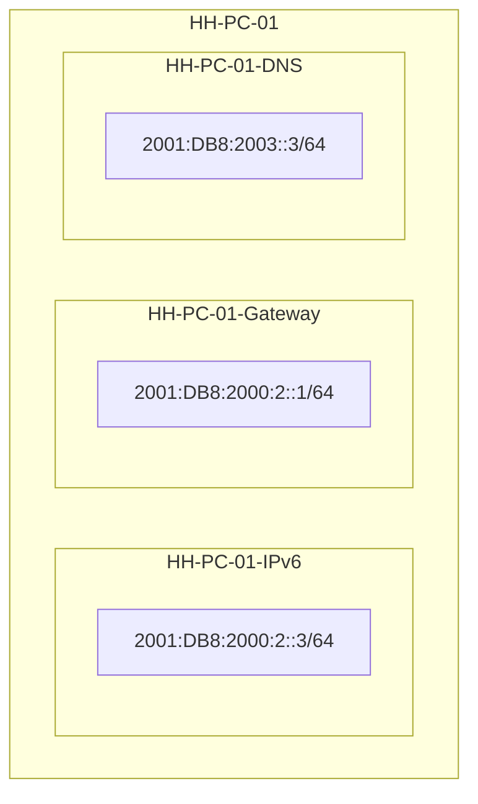
```mermaid
graph TB
    subgraph HH-PC-01
        subgraph HH-PC-01-IPv6
            HHPC01A[2001:DB8:2000:2::3/64]
        end
        subgraph HH-PC-01-Gateway
            HHPC01B[2001:DB8:2000:2::1/64]
        end
        subgraph HH-PC-01-DNS
            HHPC01C[2001:DB8:2003::3/64]
        end
    end
```

##### HH-PC-02

| Hostname | IPv6                  | Device |
| -------- | --------------------- | ------ |
| HH-PC-02 | 2001:db8:2000:3::3/64 | PC-PT  |


```mermaid
graph TB
    subgraph HH-PC-02
        subgraph HH-PC-02-IPv6
            HHPC02A[2001:DB8:2000:3::3/64]
        end
        subgraph HH-PC-02-Gateway
            HHPC02B[2001:DB8:2000:3::1/64]
        end
        subgraph HH-PC-02-DNS
            HHPC02C[2001:DB8:2003::3/64]
        end
    end
```

#### HH-SWS-01

| Hostname  | IPv6             | Device    |
| --------- | ---------------- | --------- |
| HH-SWS-01 | 2001:db8:2000::7 | 3650-24PS |

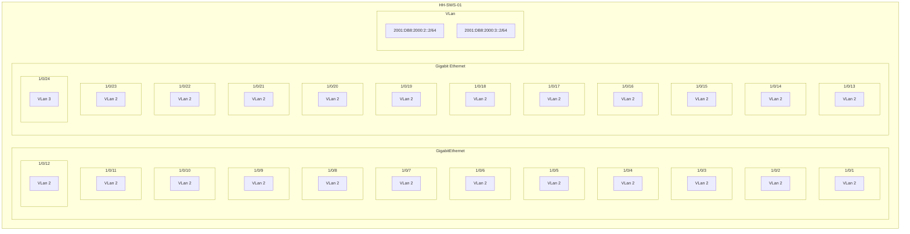
```mermaid
graph TB
    subgraph HH-SWS-01
        subgraph GigabitEthernet
            subgraph 1/0/1
                HHSWSB[VLan 2]
            end
            subgraph 1/0/2
                HHSWSC[VLan 2]
            end
            subgraph 1/0/3
                HHSWSD[VLan 2]
            end
            subgraph 1/0/4
                HHSWSE[VLan 2]
            end
            subgraph 1/0/5
                HHSWSF[VLan 2]
            end
            subgraph 1/0/6
                HHSWSG[VLan 2]
            end
            subgraph 1/0/7
                HHSWSH[VLan 2]
            end
            subgraph 1/0/8
                HHSWSI[VLan 2]
            end
            subgraph 1/0/9
                HHSWSJ[VLan 2]
            end
            subgraph 1/0/10
                HHSWSK[VLan 2]
            end
            subgraph 1/0/11
                HHSWSL[VLan 2]
            end
            subgraph 1/0/12
                HHSWSM[VLan 2]
            end
        end
        subgraph Gigabit Ethernet
            subgraph 1/0/13
                HHSWSN[VLan 2]
            end
            subgraph 1/0/14
                HHSWSO[VLan 2]
            end
            subgraph 1/0/15
                HHSWSP[VLan 2]
            end
            subgraph 1/0/16
                HHSWSQ[VLan 2]
            end
            subgraph 1/0/17
                HHSWSR[VLan 2]
            end
            subgraph 1/0/18
                HHSWSS[VLan 2]
            end
            subgraph 1/0/19
                HHSWST[VLan 2]
            end
            subgraph 1/0/20
                HHSWSU[VLan 2]
            end
            subgraph 1/0/21
                HHSWSAV[VLan 2]
            end
            subgraph 1/0/22
                HHSWSW[VLan 2]
            end
            subgraph 1/0/23
                HHSWSAX[VLan 2]
            end
            subgraph 1/0/24
                HHSWSY[VLan 3]
            end
        end
        subgraph VLan
            HHSWSV2[2001:DB8:2000:2::2/64]
            HHSWSV3[2001:DB8:2000:3::2/64]
        end
    end
```

##### Running Config

```sh
!
version 16.3.2
no service timestamps log datetime msec
no service timestamps debug datetime msec
no service password-encryption
!
hostname HH-SWS-01
!
enable password cisco123!
!
no ip cef
no ipv6 cef
!
username cisco password 0 cisco123!
username noahzmr password 0 Moin123!
!
ip ssh version 2
ip domain-name noerkelit.online
!
spanning-tree mode pvst
!
interface GigabitEthernet1/0/1
 switchport access vlan 2
 switchport trunk allowed vlan 2-3
 switchport mode trunk
 switchport nonegotiate
!
interface GigabitEthernet1/0/2
 switchport access vlan 2
 switchport trunk allowed vlan 2-3
 switchport mode trunk
 switchport nonegotiate
!
interface GigabitEthernet1/0/3
 switchport access vlan 2
 switchport trunk allowed vlan 2-3
 switchport mode access
 switchport nonegotiate
!
interface GigabitEthernet1/0/4
 switchport access vlan 2
 switchport trunk allowed vlan 2-3
 switchport mode access
 switchport nonegotiate
!
interface GigabitEthernet1/0/5
 switchport access vlan 2
 switchport trunk allowed vlan 2-3
 switchport mode access
 switchport nonegotiate
!
interface GigabitEthernet1/0/6
 switchport access vlan 2
 switchport trunk allowed vlan 2-3
 switchport mode access
 switchport nonegotiate
!
interface GigabitEthernet1/0/7
 switchport access vlan 2
 switchport trunk allowed vlan 2-3
 switchport mode access
 switchport nonegotiate
!
interface GigabitEthernet1/0/8
 switchport access vlan 2
 switchport trunk allowed vlan 2-3
 switchport mode access
 switchport nonegotiate
!
interface GigabitEthernet1/0/9
 switchport access vlan 2
 switchport trunk allowed vlan 2-3
 switchport mode access
 switchport nonegotiate
!
interface GigabitEthernet1/0/10
 switchport access vlan 2
 switchport trunk allowed vlan 2-3
 switchport mode access
 switchport nonegotiate
!
interface GigabitEthernet1/0/11
 switchport access vlan 2
 switchport trunk allowed vlan 2-3
 switchport mode access
 switchport nonegotiate
!
interface GigabitEthernet1/0/12
 switchport access vlan 2
 switchport trunk allowed vlan 2-3
 switchport mode access
 switchport nonegotiate
!
interface GigabitEthernet1/0/13
 switchport access vlan 2
 switchport trunk allowed vlan 2-3
 switchport mode access
 switchport nonegotiate
!
interface GigabitEthernet1/0/14
 switchport access vlan 2
 switchport trunk allowed vlan 2-3
 switchport mode access
 switchport nonegotiate
!
interface GigabitEthernet1/0/15
 switchport access vlan 2
 switchport trunk allowed vlan 2-3
 switchport mode access
 switchport nonegotiate
!
interface GigabitEthernet1/0/16
 switchport access vlan 2
 switchport trunk allowed vlan 2-3
 switchport mode access
 switchport nonegotiate
!
interface GigabitEthernet1/0/17
 switchport access vlan 2
 switchport trunk allowed vlan 2-3
 switchport mode access
 switchport nonegotiate
!
interface GigabitEthernet1/0/18
 switchport access vlan 2
 switchport trunk allowed vlan 2-3
 switchport mode access
 switchport nonegotiate
!
interface GigabitEthernet1/0/19
 switchport access vlan 2
 switchport trunk allowed vlan 2-3
 switchport mode access
 switchport nonegotiate
!
interface GigabitEthernet1/0/20
 switchport access vlan 2
 switchport trunk allowed vlan 2-3
 switchport mode access
 switchport nonegotiate
!
interface GigabitEthernet1/0/21
 switchport access vlan 2
 switchport trunk allowed vlan 2-3
 switchport mode access
 switchport nonegotiate
!
interface GigabitEthernet1/0/22
 switchport access vlan 2
 switchport trunk allowed vlan 2-3
 switchport mode access
 switchport nonegotiate
!
interface GigabitEthernet1/0/23
 switchport access vlan 2
 switchport trunk allowed vlan 2-3
 switchport mode access
 switchport nonegotiate
!
interface GigabitEthernet1/0/24
 switchport access vlan 3
 switchport trunk allowed vlan 2-3
 switchport mode access
 switchport nonegotiate
!
interface GigabitEthernet1/1/1
 switchport access vlan 2
 switchport trunk allowed vlan 2-3
 switchport mode access
 switchport nonegotiate
!
interface GigabitEthernet1/1/2
 switchport access vlan 2
 switchport trunk allowed vlan 2-3
 switchport mode access
 switchport nonegotiate
!
interface GigabitEthernet1/1/3
 switchport access vlan 2
 switchport trunk allowed vlan 2-3
 switchport mode access
 switchport nonegotiate
!
interface GigabitEthernet1/1/4
 switchport access vlan 2
 switchport trunk allowed vlan 2-3
 switchport mode access
 switchport nonegotiate
!
interface Vlan1
 no ip address
 shutdown
!
interface Vlan2
 mac-address 0001.c949.0601
 ip address 10.0.1.2 255.255.255.192
 ipv6 address 2001:DB8:2000:2::2/64
!
interface Vlan3
 mac-address 0001.c949.0602
 ip address 10.0.1.66 255.255.255.192
 ipv6 address 2001:DB8:2000:3::2/64
!
ip classless
!
ip flow-export version 9
!
ipv6 route 2001:DB8:2000::/48 GigabitEthernet1/0/1
!
banner motd #
********************************************************
*                                                      *
*     Access restricted to authorized personnel        *
*                                                      *
*  This system contains confidential information and   *
*  is intended for authorized users only. Unauthorized *
*  access attempts are strictly prohibited. Changes    *
*  made to the configuration may have implications     *
*  for the company. Ensure that you have the necessary *
*  authorization to make any modifications.            *
*                                                      *
*  All changes must be saved to persist after a        *
*  restart.                                            *
*                                                      *
*  Remember to properly log out when you have          *
*  completed your work.                                *
*                                                      *
********************************************************
#
!
line con 0
 password cisco123!
!
line aux 0
!
line vty 0 4
 transport input ssh
 login local
line vty 5 15
 login
!
end
```

#### HH-RT-01

| Hostname | IPv6                  | Port                  | Device  |
| -------- | --------------------- | --------------------- | ------- |
| HH-RT-01 | fd00::18/128          | Serial0/1/0           | ISR4331 |
| HH-RT-01 | 2001:db8:2000:2::1/64 | Gigabit Ethernet0/0/0 | ISR4331 |
| HH-RT-01 | fd00::16/128          | Serial0/1/1           | ISR4331 |
| HH-RT-01 | fd00::17/128          | Serial0/2/0           | ISR4331 |

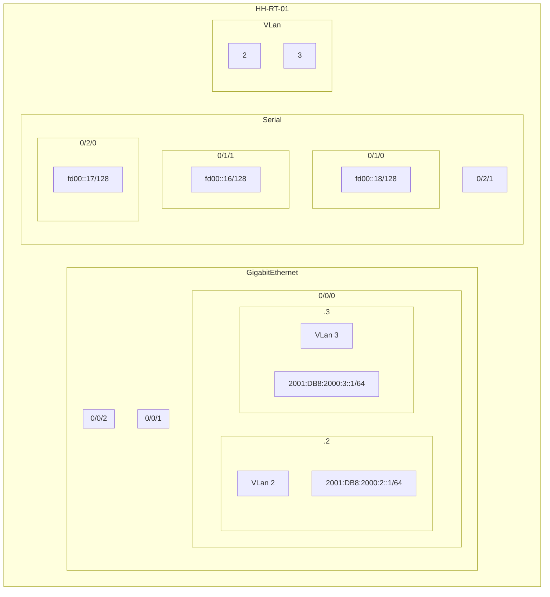
```mermaid
graph TB
    subgraph HH-RT-01
        subgraph GigabitEthernet
            subgraph 0/0/0
                subgraph .2
                    HHRTB[VLan 2]
                    HHRTBIP[2001:DB8:2000:2::1/64]
                end
                subgraph .3
                    HHRTC[VLan 3]
                    HHRTCIP[2001:DB8:2000:3::1/64]
                end
            end
            subgraph 0/0/1
            end
            subgraph 0/0/2
            end
        end
        subgraph Serial
            subgraph 0/1/0
              HHRTD[fd00::18/128]
            end
            subgraph 0/1/1
              HHRTE[fd00::16/128]
            end
            subgraph 0/2/0
              HHRTF[fd00::17/128]
            end
            HHRTG[0/2/1]
        end
        subgraph VLan
            HHRTV2[2]
            HHRTV[3]
        end
    end
```

##### Running Config

```sh
!
version 15.4
no service timestamps log datetime msec
no service timestamps debug datetime msec
no service password-encryption
!
hostname HH-RT-01
!
enable password cisco123!
!
no ip cef
ipv6 unicast-routing
!
no ipv6 cef
!
username cisco password 0 cisco123!
username noahzmr password 0 Moin123!
!
ip ssh version 2
ip domain-name noerkelit.online
!
spanning-tree mode pvst
!
interface Loopback0
 description Loopback für HH-RT-01
 no ip address
 ipv6 address FD00::15/128
!
interface GigabitEthernet0/0/0
 no ip address
 duplex auto
 speed auto
!
interface GigabitEthernet0/0/0.2
 encapsulation dot1Q 2
 ip address 10.0.1.1 255.255.255.192
 ip helper-address 10.0.3.3
 ipv6 address 2001:DB8:2000:2::1/64
!
interface GigabitEthernet0/0/0.3
 encapsulation dot1Q 3
 ip address 10.0.1.65 255.255.255.192
 ip helper-address 10.0.3.3
 ipv6 address 2001:DB8:2000:3::1/64
!
interface GigabitEthernet0/0/0.21
 no ip address
!
interface GigabitEthernet0/0/0.22
 no ip address
!
interface GigabitEthernet0/0/1
 no ip address
 duplex auto
 speed auto
!
interface GigabitEthernet0/0/2
 no ip address
 duplex auto
 speed auto
!
interface Serial0/1/0
 ip address 192.168.1.1 255.255.255.252
 ipv6 address FD00::18/128
!
interface Serial0/1/1
 ip address 192.168.2.1 255.255.255.252
 ipv6 address FD00::16/128
!
interface Serial0/2/0
 ip address 192.168.3.1 255.255.255.252
 ipv6 address FD00::17/128
!
interface Serial0/2/1
 no ip address
 clock rate 2000000
!
interface Vlan1
 no ip address
 shutdown
!
interface Vlan2
 mac-address 00d0.bcb4.8a01
 no ip address
!
interface Vlan3
 mac-address 00d0.bcb4.8a02
 no ip address
!
router rip
!
ip classless
ip route 10.0.3.0 255.255.255.0 192.168.2.2
ip route 10.0.2.0 255.255.255.192 192.168.1.2
ip route 10.0.4.0 255.255.255.0 192.168.3.2
ip route 10.0.1.0 255.255.255.192 GigabitEthernet0/0/0.3
ip route 10.0.1.0 255.255.255.192 GigabitEthernet0/0/0.2
ip route 10.0.2.0 255.255.255.0 192.168.1.2
!
ip flow-export version 9
!
ipv6 route 2001:DB8:2003::/48 Serial0/1/1
ipv6 route 2001:DB8:2001::/48 Serial0/1/0
ipv6 route 2001:DB8:2004::/48 Serial0/2/0
ipv6 route 2001:DB8:2000:2::/64 GigabitEthernet0/0/0.2
ipv6 route 2001:DB8:2000:3::/64 GigabitEthernet0/0/0.3
!
ipv6 access-list HH-SSH
 permit tcp 2001:DB8::/32 any eq 22
!
banner motd #
********************************************************
*                                                      *
*     Access restricted to authorized personnel        *
*                                                      *
*  This system contains confidential information and   *
*  is intended for authorized users only. Unauthorized *
*  access attempts are strictly prohibited. Changes    *
*  made to the configuration may have implications     *
*  for the company. Ensure that you have the necessary *
*  authorization to make any modifications.            *
*                                                      *
*  All changes must be saved to persist after a        *
*  restart.                                            *
*                                                      *
*  Remember to properly log out when you have          *
*  completed your work.                                *
*                                                      *
********************************************************
#
!
line con 0
 password cisco123!
!
line aux 0
!
line vty 0 4
 transport input ssh
 login local
line vty 5 15
 ipv6 access-class HH-SSH in
 login local
 transport input ssh
!
end
```

### Connections

| Port on the HH-SWS-01  | Connected to Device | Port from the device  |
| ---------------------- | ------------------- | --------------------- |
| Gigabit Ethernet1/0/1  | HH-RT-01            | Gigabit Ethernet0/0/0 |
| Gigabit Ethernet1/0/9  | HH-PC-01            | Fast Ethernet0        |
| Gigabit Ethernet1/0/10 | HH-PC-02            | Fast Ethernet0        |

### VLAN

| Name  | ID  | Interface             | Gloable Prefix        |
| ----- | --- | --------------------- | --------------------- |
| HH-02 | 2   | Gigabit Ethernet0/0/0 | 2001:db8:2000:2::2/64 |
| HH-03 | 3   | Gigabit Ethernet0/0/0 | 2001:db8:2000:3::2/64 |

## Lübeck



```mermaid
graph TB
    subgraph HL-PC-01
        subgraph HL-PC-01-IPv6
            HLPC01A[2001:DB8:2001:2::3/64]
        end
        subgraph HL-PC-01-Gateway
            HLPC01B[2001:DB8:2001:2::1/64]
        end
        subgraph HL-PC-01-DNS
            HLPC01C[2001:DB8:2003::3/64]
        end
    end
    subgraph HL-PC-02
        subgraph HL-PC-02-IPv6
            HLPC02A[2001:DB8:2001:3::3/64]
        end
        subgraph HL-PC-02-Gateway
            HLPC02B[2001:DB8:2001:2::1/64]
        end
        subgraph HL-PC-02-DNS
            HLPC02C[2001:DB8:2003::3/64]
        end
    end
    subgraph HL-RT-01
        subgraph GigabitEthernet
            subgraph 0/0/0
                subgraph .2
                    HLRTB[VLan 2]
                    HLRTBIP[2001:DB8:2001:2::1/64]
                end
                subgraph .3
                    HLRTC[VLan 3]
                    HLRTCIP[2001:DB8:2001:3::1/64]
                end
            end
            subgraph 0/0/1
            end
            subgraph 0/0/2
            end
        end
        subgraph Serial
            subgraph 0/1/0
              HLRTD[fd00::13/128]
            end
            subgraph 0/1/1
              HLRTE[fd00::12/128]
            end
            subgraph 0/2/0
              HLRTF[fd00::11/128]
            end
            HLRTG[0/2/1]
        end
        subgraph VLan-Router
            HLRTV2[2]
            HLRTV[3]
        end
    end
subgraph HL-SWS-01
        subgraph Gigabit-Ethernet
            subgraph 1/0/1
                HLSWSB[VLan 2]
            end
            subgraph 1/0/2
                HLSWSC[VLan 2]
            end
            subgraph 1/0/3
                HLSWSD[VLan 2]
            end
            subgraph 1/0/4
                HLSWSE[VLan 2]
            end
            subgraph 1/0/5
                HLSWSF[VLan 2]
            end
            subgraph 1/0/6
                HLSWSG[VLan 2]
            end
            subgraph 1/0/7
                HLSWSH[VLan 2]
            end
            subgraph 1/0/8
                HLSWSI[VLan 2]
            end
            subgraph 1/0/9
                HLSWSJ[VLan 2]
            end
            subgraph 1/0/10
                HLSWSK[VLan 2]
            end
            subgraph 1/0/11
                HLSWSL[VLan 2]
            end
            subgraph 1/0/12
                HLSWSM[VLan 2]
            end
        end
        subgraph Gigabit Ethernet
            subgraph 1/0/13
                HLSWSN[VLan 2]
            end
            subgraph 1/0/14
                HLSWSO[VLan 2]
            end
            subgraph 1/0/15
                HLSWSP[VLan 2]
            end
            subgraph 1/0/16
                HLSWSQ[VLan 2]
            end
            subgraph 1/0/17
                HLSWSR[VLan 2]
            end
            subgraph 1/0/18
                HLSWSS[VLan 2]
            end
            subgraph 1/0/19
                HLSWST[VLan 2]
            end
            subgraph 1/0/20
                HLSWSU[VLan 2]
            end
            subgraph 1/0/21
                HLSWSAV[VLan 2]
            end
            subgraph 1/0/22
                HLSWSW[VLan 2]
            end
            subgraph 1/0/23
                HLSWSAX[VLan 2]
            end
            subgraph 1/0/24
                HLSWSY[VLan 3]
            end
        end
        subgraph VLan
            HLSWSV2[2001:DB8:2001:2::2/64]
            HLSWSV3[2001:DB8:2001:3::2/64]
        end
    end

    HLPC01A<-->HLSWSJ
    HLPC02A<--->HLSWSY
    HLSWSB<-->0/0/0
```

### Devices

#### Clients

##### HL-PC-01

| Hostname | IPv6                  | Device |
| -------- | --------------------- | ------ |
| HL-PC-01 | 2001:db8:2001:2::3/64 | PC-PT  |


```mermaid
graph TB
    subgraph HL-PC-01
        subgraph HL-PC-01-IPv6
            HLPC01A[2001:DB8:2001:2::3/64]
        end
        subgraph HL-PC-01-Gateway
            HLPC01B[2001:DB8:2001:2::1/64]
        end
        subgraph HL-PC-01-DNS
            HLPC01C[2001:DB8:2003::3/64]
        end
    end
```

##### HL-PC-02

| Hostname | IPv6                  | Device |
| -------- | --------------------- | ------ |
| HL-PC-02 | 2001:db8:2001:3::3/64 | PC-PT  |

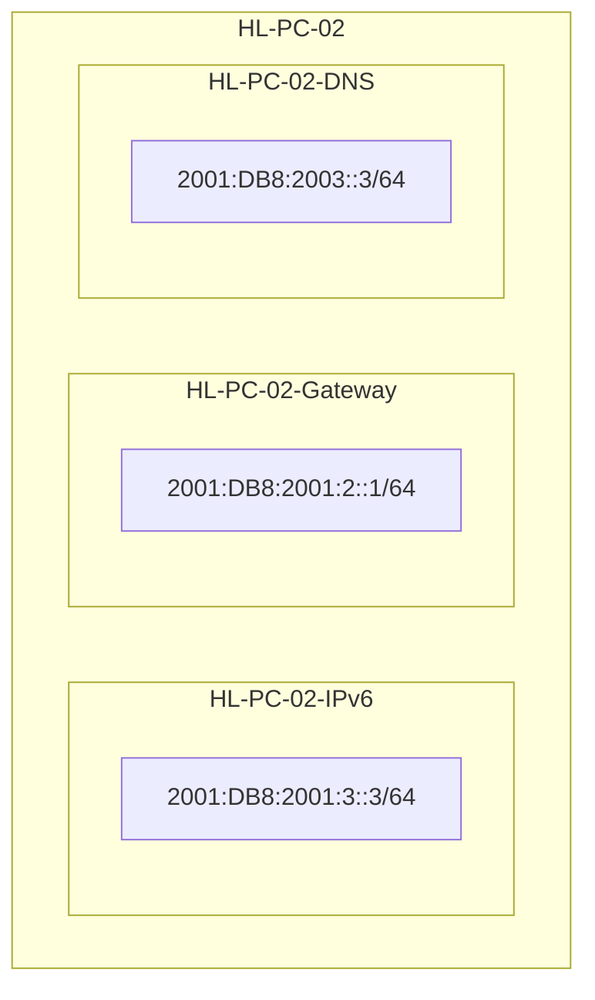
```mermaid
graph TB
    subgraph HL-PC-02
        subgraph HL-PC-02-IPv6
            HLPC02A[2001:DB8:2001:3::3/64]
        end
        subgraph HL-PC-02-Gateway
            HLPC02B[2001:DB8:2001:2::1/64]
        end
        subgraph HL-PC-02-DNS
            HLPC02C[2001:DB8:2003::3/64]
        end
    end
```

#### HL-SWS-01

| Hostname  | IPv6             | Device    |
| --------- | ---------------- | --------- |
| HL-SWS-01 | 2001:db8:2001::8 | 3650-24PS |

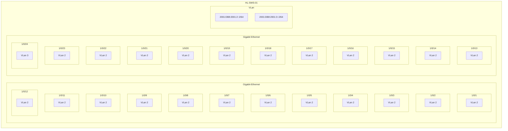
```mermaid
graph TB
    subgraph HL-SWS-01
        subgraph Gigabit-Ethernet
            subgraph 1/0/1
                HLSWSB[VLan 2]
            end
            subgraph 1/0/2
                HLSWSC[VLan 2]
            end
            subgraph 1/0/3
                HLSWSD[VLan 2]
            end
            subgraph 1/0/4
                HLSWSE[VLan 2]
            end
            subgraph 1/0/5
                HLSWSF[VLan 2]
            end
            subgraph 1/0/6
                HLSWSG[VLan 2]
            end
            subgraph 1/0/7
                HLSWSH[VLan 2]
            end
            subgraph 1/0/8
                HLSWSI[VLan 2]
            end
            subgraph 1/0/9
                HLSWSJ[VLan 2]
            end
            subgraph 1/0/10
                HLSWSK[VLan 2]
            end
            subgraph 1/0/11
                HLSWSL[VLan 2]
            end
            subgraph 1/0/12
                HLSWSM[VLan 2]
            end
        end
        subgraph Gigabit Ethernet
            subgraph 1/0/13
                HLSWSN[VLan 2]
            end
            subgraph 1/0/14
                HLSWSO[VLan 2]
            end
            subgraph 1/0/15
                HLSWSP[VLan 2]
            end
            subgraph 1/0/16
                HLSWSQ[VLan 2]
            end
            subgraph 1/0/17
                HLSWSR[VLan 2]
            end
            subgraph 1/0/18
                HLSWSS[VLan 2]
            end
            subgraph 1/0/19
                HLSWST[VLan 2]
            end
            subgraph 1/0/20
                HLSWSU[VLan 2]
            end
            subgraph 1/0/21
                HLSWSAV[VLan 2]
            end
            subgraph 1/0/22
                HLSWSW[VLan 2]
            end
            subgraph 1/0/23
                HLSWSAX[VLan 2]
            end
            subgraph 1/0/24
                HLSWSY[VLan 3]
            end
        end
        subgraph VLan
            HLSWSV2[2001:DB8:2001:2::2/64]
            HLSWSV3[2001:DB8:2001:3::2/64]
        end
    end
```

##### Running Config

```sh
!
version 16.3.2
no service timestamps log datetime msec
no service timestamps debug datetime msec
no service password-encryption
!
hostname HL-SWS-01
!
enable password cisco123!
!
no ip cef
no ipv6 cef
!
username cisco password 0 cisco123!
username noahzmr password 0 Moin123!
!
ip ssh version 2
ip domain-name noerkelit.online
!
spanning-tree mode pvst
!
interface GigabitEthernet1/0/1
 switchport access vlan 2
 switchport trunk allowed vlan 2-3
 switchport mode trunk
!
interface GigabitEthernet1/0/2
 switchport access vlan 2
 switchport trunk allowed vlan 2-3
 switchport mode access
 switchport nonegotiate
!
interface GigabitEthernet1/0/3
 switchport access vlan 2
 switchport trunk allowed vlan 2-3
 switchport mode access
 switchport nonegotiate
!
interface GigabitEthernet1/0/4
 switchport access vlan 2
 switchport trunk allowed vlan 2-3
 switchport mode access
 switchport nonegotiate
!
interface GigabitEthernet1/0/5
 switchport access vlan 2
 switchport trunk allowed vlan 2-3
 switchport mode access
 switchport nonegotiate
!
interface GigabitEthernet1/0/6
 switchport access vlan 2
 switchport trunk allowed vlan 2-3
 switchport mode access
 switchport nonegotiate
!
interface GigabitEthernet1/0/7
 switchport access vlan 2
 switchport trunk allowed vlan 2-3
 switchport mode access
 switchport nonegotiate
!
interface GigabitEthernet1/0/8
 switchport access vlan 2
 switchport trunk allowed vlan 2-3
 switchport mode access
 switchport nonegotiate
!
interface GigabitEthernet1/0/9
 switchport access vlan 2
 switchport trunk allowed vlan 2-3
 switchport mode access
 switchport nonegotiate
!
interface GigabitEthernet1/0/10
 switchport access vlan 2
 switchport trunk allowed vlan 2-3
 switchport mode access
 switchport nonegotiate
!
interface GigabitEthernet1/0/11
 switchport access vlan 2
 switchport trunk allowed vlan 2-3
 switchport mode access
 switchport nonegotiate
!
interface GigabitEthernet1/0/12
 switchport access vlan 2
 switchport trunk allowed vlan 2-3
 switchport mode access
 switchport nonegotiate
!
interface GigabitEthernet1/0/13
 switchport access vlan 2
 switchport trunk allowed vlan 2-3
 switchport mode access
 switchport nonegotiate
!
interface GigabitEthernet1/0/14
 switchport access vlan 2
 switchport trunk allowed vlan 2-3
 switchport mode access
 switchport nonegotiate
!
interface GigabitEthernet1/0/15
 switchport access vlan 2
 switchport trunk allowed vlan 2-3
 switchport mode access
 switchport nonegotiate
!
interface GigabitEthernet1/0/16
 switchport access vlan 2
 switchport trunk allowed vlan 2-3
 switchport mode access
 switchport nonegotiate
!
interface GigabitEthernet1/0/17
 switchport access vlan 2
 switchport trunk allowed vlan 2-3
 switchport mode access
 switchport nonegotiate
!
interface GigabitEthernet1/0/18
 switchport access vlan 2
 switchport trunk allowed vlan 2-3
 switchport mode access
 switchport nonegotiate
!
interface GigabitEthernet1/0/19
 switchport access vlan 2
 switchport trunk allowed vlan 2-3
 switchport mode access
 switchport nonegotiate
!
interface GigabitEthernet1/0/20
 switchport access vlan 2
 switchport trunk allowed vlan 2-3
 switchport mode access
 switchport nonegotiate
!
interface GigabitEthernet1/0/21
 switchport access vlan 2
 switchport trunk allowed vlan 2-3
 switchport mode access
 switchport nonegotiate
!
interface GigabitEthernet1/0/22
 switchport access vlan 2
 switchport trunk allowed vlan 2-3
 switchport mode access
 switchport nonegotiate
!
interface GigabitEthernet1/0/23
 switchport access vlan 2
 switchport trunk allowed vlan 2-3
 switchport mode access
 switchport nonegotiate
!
interface GigabitEthernet1/0/24
 switchport access vlan 3
 switchport trunk allowed vlan 2-3
 switchport mode access
 switchport nonegotiate
!
interface GigabitEthernet1/1/1
 switchport access vlan 2
 switchport trunk allowed vlan 2-3
 switchport mode access
 switchport nonegotiate
!
interface GigabitEthernet1/1/2
 switchport access vlan 2
 switchport trunk allowed vlan 2-3
 switchport mode access
 switchport nonegotiate
!
interface GigabitEthernet1/1/3
 switchport access vlan 2
 switchport trunk allowed vlan 2-3
 switchport mode access
 switchport nonegotiate
!
interface GigabitEthernet1/1/4
 switchport access vlan 2
 switchport trunk allowed vlan 2-3
 switchport mode access
 switchport nonegotiate
!
interface Vlan1
 no ip address
 shutdown
!
interface Vlan2
 mac-address 0001.4393.0a01
 ip address 10.0.2.2 255.255.255.192
 ipv6 address 2001:DB8:2001:2::2/64
!
interface Vlan3
 mac-address 0001.4393.0a02
 ip address 10.0.2.67 255.255.255.192
 ipv6 address 2001:DB8:2001:3::2/64
!
ip classless
!
ip flow-export version 9
!
banner motd #
********************************************************
*                                                      *
*     Access restricted to authorized personnel        *
*                                                      *
*  This system contains confidential information and   *
*  is intended for authorized users only. Unauthorized *
*  access attempts are strictly prohibited. Changes    *
*  made to the configuration may have implications     *
*  for the company. Ensure that you have the necessary *
*  authorization to make any modifications.            *
*                                                      *
*  All changes must be saved to persist after a        *
*  restart.                                            *
*                                                      *
*  Remember to properly log out when you have          *
*  completed your work.                                *
*                                                      *
********************************************************
#
!
line con 0
 password cisco123!
!
line aux 0
!
line vty 0 4
 transport input ssh
 login local
!
end
```

#### HL-RT-01

| Hostname | IPv6                  | Port                  | Device  |
| -------- | --------------------- | --------------------- | ------- |
| HL-RT-01 | fd00::13/128          | Serial0/1/0           | ISR4331 |
| HL-RT-01 | fd00::12/128          | Serial0/1/1           | ISR4331 |
| HL-RT-01 | 2001:db8:2001:2::1/64 | Gigabit Ethernet0/0/0 | ISR4331 |
| HL-RT-01 | fd00::11/128          | Serial0/2/0           | ISR4331 |

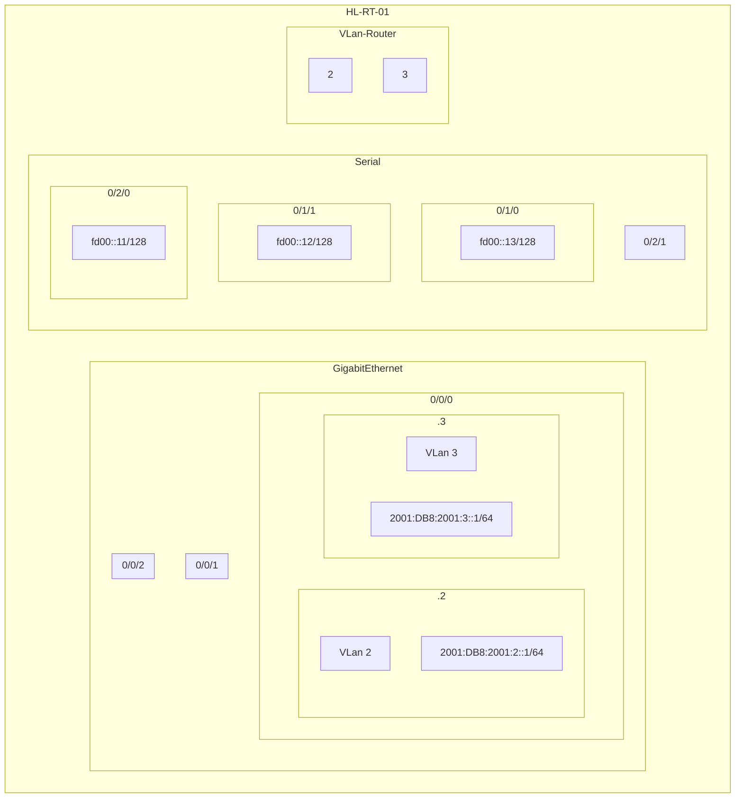
```mermaid
graph TB
    subgraph HL-RT-01
        subgraph GigabitEthernet
            subgraph 0/0/0
                subgraph .2
                    HLRTB[VLan 2]
                    HLRTBIP[2001:DB8:2001:2::1/64]
                end
                subgraph .3
                    HLRTC[VLan 3]
                    HLRTCIP[2001:DB8:2001:3::1/64]
                end
            end
            subgraph 0/0/1
            end
            subgraph 0/0/2
            end
        end
        subgraph Serial
            subgraph 0/1/0
              HLRTD[fd00::13/128]
            end
            subgraph 0/1/1
              HLRTE[fd00::12/128]
            end
            subgraph 0/2/0
              HLRTF[fd00::11/128]
            end
            HLRTG[0/2/1]
        end
        subgraph VLan-Router
            HLRTV2[2]
            HLRTV[3]
        end
    end
```

##### Running Config

```sh
!
version 15.4
no service timestamps log datetime msec
no service timestamps debug datetime msec
no service password-encryption
!
hostname HL-RT-01
!
enable password cisco123!
!
no ip cef
ipv6 unicast-routing
!
no ipv6 cef
!
username cisco password 0 cisco123!
username noahzmr password 0 Moin123!
!
ip ssh version 1
ip domain-name noerkelit.online
!
spanning-tree mode pvst
!
interface Loopback0
 description Loopback für HL-RT-01
 no ip address
 ipv6 address FD00::15/128
!
interface GigabitEthernet0/0/0
 no ip address
 duplex auto
 speed auto
!
interface GigabitEthernet0/0/0.2
 encapsulation dot1Q 2
 ip address 10.0.2.1 255.255.255.192
 ip helper-address 10.0.3.3
 ipv6 address 2001:DB8:2001:2::1/64
!
interface GigabitEthernet0/0/0.3
 encapsulation dot1Q 3
 ip address 10.0.2.65 255.255.255.192
 ip helper-address 10.0.3.3
 ipv6 address 2001:DB8:2001:3::1/64
!
interface GigabitEthernet0/0/1
 no ip address
 duplex auto
 speed auto
!
interface GigabitEthernet0/0/2
 no ip address
 duplex auto
 speed auto
!
interface Serial0/1/0
 ip address 192.168.1.2 255.255.255.252
 ipv6 address FD00::13/128
 clock rate 2000000
!
interface Serial0/1/1
 ip address 192.168.4.1 255.255.255.252
 ipv6 address FD00::12/128
 clock rate 2000000
!
interface Serial0/2/0
 ip address 192.168.5.1 255.255.255.252
 ipv6 address FD00::11/128
!
interface Serial0/2/1
 no ip address
 clock rate 2000000
!
interface Vlan1
 no ip address
 shutdown
!
interface Vlan2
 mac-address 0009.7cc7.2301
 no ip address
!
interface Vlan3
 mac-address 0009.7cc7.2302
 no ip address
!
router rip
!
ip classless
ip route 10.0.1.0 255.255.255.192 192.168.1.1
ip route 10.0.3.0 255.255.255.0 192.168.4.2
ip route 10.0.4.0 255.255.255.0 192.168.5.2
ip route 10.0.2.0 255.255.255.192 GigabitEthernet0/0/0.3
ip route 10.0.2.0 255.255.255.192 GigabitEthernet0/0/0.2
ip route 10.0.1.0 255.255.255.0 192.168.1.1
!
ip flow-export version 9
!
ipv6 route 2001:DB8:2001::/48 GigabitEthernet0/0/0
ipv6 route 2001:DB8:2000::/48 Serial0/1/0
ipv6 route 2001:DB8:2003::/48 Serial0/1/1
ipv6 route 2001:DB8:2004::/48 Serial0/2/0
ipv6 route 2001:DB8:2001:3::/64 GigabitEthernet0/0/0.3
ipv6 route 2001:DB8:2001:2::/64 GigabitEthernet0/0/0.2
!
ipv6 access-list HL-SSH
 permit tcp 2001:DB8::/32 any eq 22
!
banner motd #
********************************************************
*                                                      *
*     Access restricted to authorized personnel        *
*                                                      *
*  This system contains confidential information and   *
*  is intended for authorized users only. Unauthorized *
*  access attempts are strictly prohibited. Changes    *
*  made to the configuration may have implications     *
*  for the company. Ensure that you have the necessary *
*  authorization to make any modifications.            *
*                                                      *
*  All changes must be saved to persist after a        *
*  restart.                                            *
*                                                      *
*  Remember to properly log out when you have          *
*  completed your work.                                *
*                                                      *
********************************************************
#
!
line con 0
 password cisco123!
!
line aux 0
!
line vty 0 4
 transport input ssh
 login local
line vty 5 15
 ipv6 access-class HL-SSH in
 login local
 transport input ssh
!
end
```

### Connections

| Port on the HL-SWS-01  | Connected to Device | Port from the device  |
| ---------------------- | ------------------- | --------------------- |
| Gigabit Ethernet1/0/1  | HL-RT-01            | Gigabit Ethernet0/0/0 |
| Gigabit Ethernet1/0/9  | HL-PC-01            | Fast Ethernet0        |
| Gigabit Ethernet1/0/10 | HL-PC-02            | Fast Ethernet0        |

### VLAN

| Name  | ID  | Interface             | Gloable Prefix        |
| ----- | --- | --------------------- | --------------------- |
| HL-02 | 2   | Gigabit Ethernet0/0/0 | 2001:db8:2001:2::2/64 |
| HL-03 | 3   | Gigabit Ethernet0/0/0 | 2001:db8:2001:3::2/64 |

## Berlin


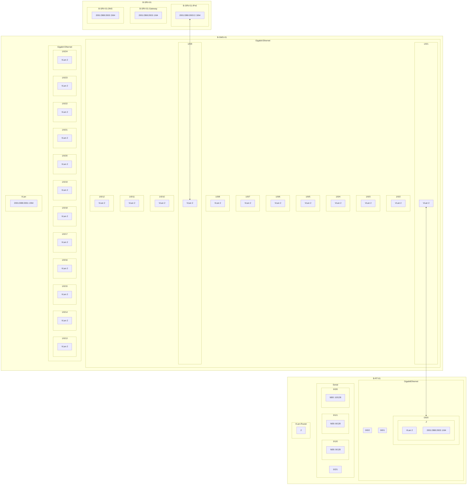
```mermaid
graph TB
    subgraph B-SRV-01
        subgraph B-SRV-01-IPv6
            BSRV01A[2001:DB8:2003:2::3/64]
        end
        subgraph B-SRV-01-Gateway
            BSRV01B[2001:DB8:2003::1/64]
        end
        subgraph B-SRV-01-DNS
            BSRV01C[2001:DB8:2003::3/64]
        end
    end
    subgraph B-RT-01
        subgraph GigabitEthernet
            subgraph 0/0/0
                subgraph .2
                    BRTB[VLan 2]
                    BRTBIP[2001:DB8:2003::1/64]
                end
            end
            subgraph 0/0/1
            end
            subgraph 0/0/2
            end
        end
        subgraph Serial
            subgraph 0/1/0
              BRTD[fd00::9/128]
            end
            subgraph 0/1/1
              BRTE[fd00::8/128]
            end
            subgraph 0/2/0
              BRTF[fd00::10/128]
            end
            BRTG[0/2/1]
        end
        subgraph VLan-Router
            BRTV2[2]
        end
    end
    subgraph B-SWS-01
        subgraph Gigabit-Ethernet
            subgraph 1/0/1
                BSWSB[VLan 2]
            end
            subgraph 1/0/2
                BSWSC[VLan 2]
            end
            subgraph 1/0/3
                BSWSD[VLan 2]
            end
            subgraph 1/0/4
                BSWSE[VLan 2]
            end
            subgraph 1/0/5
                BSWSF[VLan 2]
            end
            subgraph 1/0/6
                BSWSG[VLan 2]
            end
            subgraph 1/0/7
                BSWSH[VLan 2]
            end
            subgraph 1/0/8
                BSWSI[VLan 2]
            end
            subgraph 1/0/9
                BSWSJ[VLan 2]
            end
            subgraph 1/0/10
                BSWSK[VLan 2]
            end
            subgraph 1/0/11
                BSWSL[VLan 2]
            end
            subgraph 1/0/12
                BSWSM[VLan 2]
            end
        end
        subgraph Gigabit Ethernet
            subgraph 1/0/13
                BSWSN[VLan 2]
            end
            subgraph 1/0/14
                BSWSO[VLan 2]
            end
            subgraph 1/0/15
                BSWSP[VLan 2]
            end
            subgraph 1/0/16
                BSWSQ[VLan 2]
            end
            subgraph 1/0/17
                BSWSR[VLan 2]
            end
            subgraph 1/0/18
                BSWSS[VLan 2]
            end
            subgraph 1/0/19
                BSWST[VLan 2]
            end
            subgraph 1/0/20
                BSWSU[VLan 2]
            end
            subgraph 1/0/21
                BSWSAV[VLan 2]
            end
            subgraph 1/0/22
                BSWSW[VLan 2]
            end
            subgraph 1/0/23
                BSWSAX[VLan 2]
            end
            subgraph 1/0/24
                BSWSY[VLan 2]
            end
        end
        subgraph VLan
            BSWSV2[2001:DB8:2001::2/64]
        end
    end

    BSRV01A<-->BSWSJ
    BSWSB<-->0/0/0
```

### Devices

#### Clients

##### B-SRV-01

| Hostname | IPv6                | Device    |
| -------- | ------------------- | --------- |
| B-SRV-01 | 2001:db8:2003::3/64 | Server-PT |

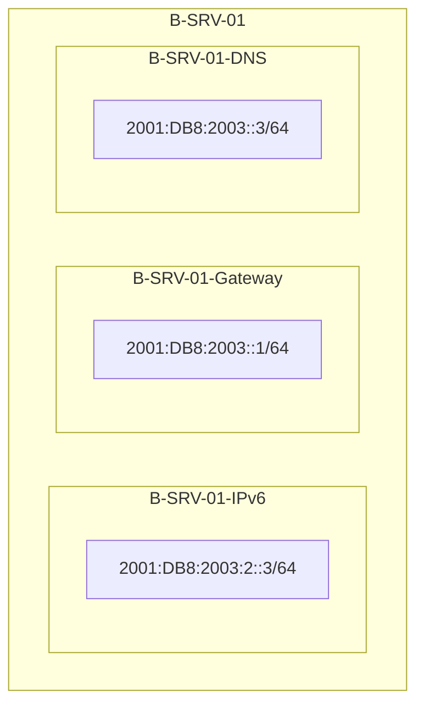
```mermaid
graph TB
    subgraph B-SRV-01
        subgraph B-SRV-01-IPv6
            BSRV01A[2001:DB8:2003:2::3/64]
        end
        subgraph B-SRV-01-Gateway
            BSRV01B[2001:DB8:2003::1/64]
        end
        subgraph B-SRV-01-DNS
            BSRV01C[2001:DB8:2003::3/64]
        end
    end
```

#### B-SWS-01

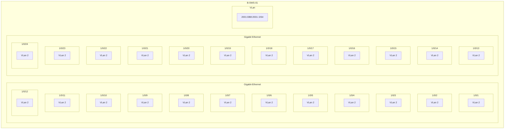
```mermaid
graph TB
    subgraph B-SWS-01
        subgraph Gigabit-Ethernet
            subgraph 1/0/1
                BSWSB[VLan 2]
            end
            subgraph 1/0/2
                BSWSC[VLan 2]
            end
            subgraph 1/0/3
                BSWSD[VLan 2]
            end
            subgraph 1/0/4
                BSWSE[VLan 2]
            end
            subgraph 1/0/5
                BSWSF[VLan 2]
            end
            subgraph 1/0/6
                BSWSG[VLan 2]
            end
            subgraph 1/0/7
                BSWSH[VLan 2]
            end
            subgraph 1/0/8
                BSWSI[VLan 2]
            end
            subgraph 1/0/9
                BSWSJ[VLan 2]
            end
            subgraph 1/0/10
                BSWSK[VLan 2]
            end
            subgraph 1/0/11
                BSWSL[VLan 2]
            end
            subgraph 1/0/12
                BSWSM[VLan 2]
            end
        end
        subgraph Gigabit Ethernet
            subgraph 1/0/13
                BSWSN[VLan 2]
            end
            subgraph 1/0/14
                BSWSO[VLan 2]
            end
            subgraph 1/0/15
                BSWSP[VLan 2]
            end
            subgraph 1/0/16
                BSWSQ[VLan 2]
            end
            subgraph 1/0/17
                BSWSR[VLan 2]
            end
            subgraph 1/0/18
                BSWSS[VLan 2]
            end
            subgraph 1/0/19
                BSWST[VLan 2]
            end
            subgraph 1/0/20
                BSWSU[VLan 2]
            end
            subgraph 1/0/21
                BSWSAV[VLan 2]
            end
            subgraph 1/0/22
                BSWSW[VLan 2]
            end
            subgraph 1/0/23
                BSWSAX[VLan 2]
            end
            subgraph 1/0/24
                BSWSY[VLan 2]
            end
        end
        subgraph VLan
            BSWSV2[2001:DB8:2001::2/64]
        end
    end
```

| Hostname | IPv6             | Device    |
| -------- | ---------------- | --------- |
| B-SWS-01 | 2001:db8:2003::9 | 3650-24PS |

##### Running Config

```sh
!
version 16.3.2
no service timestamps log datetime msec
no service timestamps debug datetime msec
no service password-encryption
!
hostname B-SWS-01
!
enable password cisco123!
!
no ip cef
no ipv6 cef
!
username cisco password 0 cisco123!
username noahzmr password 0 Moin123!
!
ip ssh version 2
ip domain-name noerkelit.online
!
spanning-tree mode pvst
!
interface GigabitEthernet1/0/1
 switchport access vlan 2
 switchport trunk allowed vlan 2
 switchport mode trunk
!
interface GigabitEthernet1/0/2
 switchport access vlan 2
 switchport trunk allowed vlan 2
 switchport mode access
 switchport nonegotiate
!
interface GigabitEthernet1/0/3
 switchport access vlan 2
 switchport trunk allowed vlan 2
 switchport mode access
 switchport nonegotiate
!
interface GigabitEthernet1/0/4
 switchport access vlan 2
 switchport trunk allowed vlan 2
 switchport mode access
 switchport nonegotiate
!
interface GigabitEthernet1/0/5
 switchport access vlan 2
 switchport trunk allowed vlan 2
 switchport mode access
 switchport nonegotiate
!
interface GigabitEthernet1/0/6
 switchport access vlan 2
 switchport trunk allowed vlan 2
 switchport mode access
 switchport nonegotiate
!
interface GigabitEthernet1/0/7
 switchport access vlan 2
 switchport trunk allowed vlan 2
 switchport mode access
 switchport nonegotiate
!
interface GigabitEthernet1/0/8
 switchport access vlan 2
 switchport trunk allowed vlan 2
 switchport mode access
 switchport nonegotiate
!
interface GigabitEthernet1/0/9
 switchport access vlan 2
 switchport trunk allowed vlan 2
 switchport mode access
 switchport nonegotiate
!
interface GigabitEthernet1/0/10
 switchport access vlan 2
 switchport trunk allowed vlan 2
 switchport mode access
 switchport nonegotiate
!
interface GigabitEthernet1/0/11
 switchport access vlan 2
 switchport trunk allowed vlan 2
 switchport mode access
 switchport nonegotiate
!
interface GigabitEthernet1/0/12
 switchport access vlan 2
 switchport trunk allowed vlan 2
 switchport mode access
 switchport nonegotiate
!
interface GigabitEthernet1/0/13
 switchport access vlan 2
 switchport trunk allowed vlan 2
 switchport mode access
 switchport nonegotiate
!
interface GigabitEthernet1/0/14
 switchport access vlan 2
 switchport trunk allowed vlan 2
 switchport mode access
 switchport nonegotiate
!
interface GigabitEthernet1/0/15
 switchport access vlan 2
 switchport trunk allowed vlan 2
 switchport mode access
 switchport nonegotiate
!
interface GigabitEthernet1/0/16
 switchport access vlan 2
 switchport trunk allowed vlan 2
 switchport mode access
 switchport nonegotiate
!
interface GigabitEthernet1/0/17
 switchport access vlan 2
 switchport trunk allowed vlan 2
 switchport mode access
 switchport nonegotiate
!
interface GigabitEthernet1/0/18
 switchport access vlan 2
 switchport trunk allowed vlan 2
 switchport mode access
 switchport nonegotiate
!
interface GigabitEthernet1/0/19
 switchport access vlan 2
 switchport trunk allowed vlan 2
 switchport mode access
 switchport nonegotiate
!
interface GigabitEthernet1/0/20
 switchport access vlan 2
 switchport trunk allowed vlan 2
 switchport mode access
 switchport nonegotiate
!
interface GigabitEthernet1/0/21
 switchport access vlan 2
 switchport trunk allowed vlan 2
 switchport mode access
 switchport nonegotiate
!
interface GigabitEthernet1/0/22
 switchport access vlan 2
 switchport trunk allowed vlan 2
 switchport mode access
 switchport nonegotiate
!
interface GigabitEthernet1/0/23
 switchport access vlan 2
 switchport trunk allowed vlan 2
 switchport mode access
 switchport nonegotiate
!
interface GigabitEthernet1/0/24
 switchport access vlan 2
 switchport trunk allowed vlan 2
 switchport mode access
 switchport nonegotiate
!
interface GigabitEthernet1/1/1
 switchport access vlan 2
 switchport trunk allowed vlan 2
 switchport mode access
!
interface GigabitEthernet1/1/2
 switchport access vlan 2
 switchport trunk allowed vlan 2
 switchport mode access
!
interface GigabitEthernet1/1/3
 switchport access vlan 2
 switchport trunk allowed vlan 2
 switchport mode access
!
interface GigabitEthernet1/1/4
 switchport access vlan 2
 switchport trunk allowed vlan 2
 switchport mode access
!
interface Vlan1
 no ip address
 shutdown
!
interface Vlan2
 description VLAN_2
 mac-address 0030.a3a1.5201
 ip address 10.0.3.2 255.255.255.0
 ipv6 address 2001:DB8:2003::2/64
!
interface Vlan3
 description VLAN_3
 mac-address 0030.a3a1.5202
 no ip address
!
ip classless
ip route 10.0.1.0 255.255.255.192 192.168.2.1
!
ip flow-export version 9
!
ipv6 route 2001:DB8:2003::/48 GigabitEthernet1/0/1
!
banner motd #
********************************************************
*                                                      *
*     Access restricted to authorized personnel        *
*                                                      *
*  This system contains confidential information and   *
*  is intended for authorized users only. Unauthorized *
*  access attempts are strictly prohibited. Changes    *
*  made to the configuration may have implications     *
*  for the company. Ensure that you have the necessary *
*  authorization to make any modifications.            *
*                                                      *
*  All changes must be saved to persist after a        *
*  restart.                                            *
*                                                      *
*  Remember to properly log out when you have          *
*  completed your work.                                *
*                                                      *
********************************************************
#
!
line con 0
 password cisco123!
!
line aux 0
!
line vty 0 4
 transport input ssh
 login local
!
end
```

#### B-RT-01

| Hostname | IPv6                | Port                  | Device  |
| -------- | ------------------- | --------------------- | ------- |
| B-RT-01  | fd00::9/128         | Serial0/1/0           | ISR4331 |
| B-RT-01  | fd00::8/128         | Serial0/1/1           | ISR4331 |
| B-RT-01  | 2001:db8:2003::1/64 | Gigabit Ethernet0/0/0 | ISR4331 |
| B-RT-01  | fd00::10/128        | Serial0/2/0           | ISR4331 |

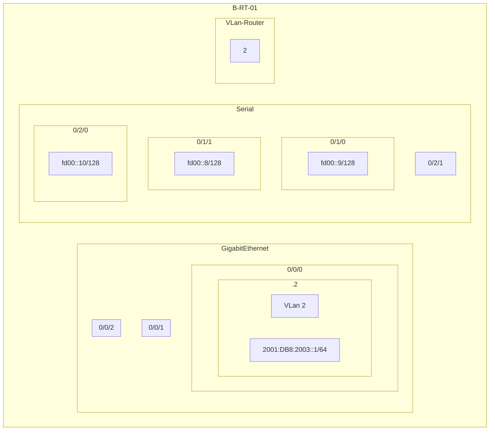
```mermaid
graph TB
    subgraph B-RT-01
        subgraph GigabitEthernet
            subgraph 0/0/0
                subgraph .2
                    BRTB[VLan 2]
                    BRTBIP[2001:DB8:2003::1/64]
                end
            end
            subgraph 0/0/1
            end
            subgraph 0/0/2
            end
        end
        subgraph Serial
            subgraph 0/1/0
              BRTD[fd00::9/128]
            end
            subgraph 0/1/1
              BRTE[fd00::8/128]
            end
            subgraph 0/2/0
              BRTF[fd00::10/128]
            end
            BRTG[0/2/1]
        end
        subgraph VLan-Router
            BRTV2[2]
        end
    end
```

##### Running Config

```sh
!
version 15.4
no service timestamps log datetime msec
no service timestamps debug datetime msec
no service password-encryption
!
hostname B-RT-01
!
enable password cisco123!
!
no ip cef
ipv6 unicast-routing
!
no ipv6 cef
!
username cisco password 0 cisco123!
username noahzmr password 0 Moin123!
!
ip ssh version 1
ip domain-name noerkelit.online
!
spanning-tree mode pvst
!
interface GigabitEthernet0/0/0
 no ip address
 duplex auto
 speed auto
!
interface GigabitEthernet0/0/0.2
 encapsulation dot1Q 2
 ip address 10.0.3.1 255.255.255.0
 ipv6 address 2001:DB8:2003::1/64
!
interface GigabitEthernet0/0/1
 no ip address
 duplex auto
 speed auto
 shutdown
!
interface GigabitEthernet0/0/2
 no ip address
 duplex auto
 speed auto
 shutdown
!
interface Serial0/1/0
 ip address 192.168.2.2 255.255.255.252
 ipv6 address FD00::9/128
 clock rate 2000000
!
interface Serial0/1/1
 ip address 192.168.4.2 255.255.255.252
 ipv6 address FD00::8/128
!
interface Serial0/2/0
 ip address 192.168.6.2 255.255.255.252
 ipv6 address FD00::10/128
!
interface Serial0/2/1
 no ip address
 clock rate 2000000
!
interface Vlan1
 no ip address
 shutdown
!
interface Vlan2
 mac-address 0003.e458.2301
 no ip address
!
router rip
!
ip classless
ip route 10.0.3.0 255.255.255.0 GigabitEthernet0/0/0.2
ip route 10.0.1.0 255.255.255.192 192.168.2.1
ip route 10.0.1.0 255.255.255.192 Serial0/1/0
ip route 10.0.2.0 255.255.255.192 192.168.4.1
ip route 10.0.4.0 255.255.255.0 192.168.6.1
ip route 10.0.1.0 255.255.255.0 192.168.2.1
ip route 10.0.2.0 255.255.255.0 192.168.4.1
!
ip flow-export version 9
!
ipv6 route 2001:DB8:2003::/48 GigabitEthernet0/0/0.2
ipv6 route 2001:DB8:2000::/48 Serial0/1/0
ipv6 route 2001:DB8:2001::/48 Serial0/1/1
ipv6 route 2001:DB8:2004::/48 Serial0/2/0
!
banner motd #
********************************************************
*                                                      *
*     Access restricted to authorized personnel        *
*                                                      *
*  This system contains confidential information and   *
*  is intended for authorized users only. Unauthorized *
*  access attempts are strictly prohibited. Changes    *
*  made to the configuration may have implications     *
*  for the company. Ensure that you have the necessary *
*  authorization to make any modifications.            *
*                                                      *
*  All changes must be saved to persist after a        *
*  restart.                                            *
*                                                      *
*  Remember to properly log out when you have          *
*  completed your work.                                *
*                                                      *
********************************************************
#
!
line con 0
 password cisco123!
!
line aux 0
!
line vty 0 4
 transport input ssh
 login local
!
end
```

### Connections

| Port on the B-SWS-01  | Connected to Device | Port from the device  |
| --------------------- | ------------------- | --------------------- |
| Gigabit Ethernet1/0/1 | B-RT-01             | Gigabit Ethernet0/0/0 |
| Gigabit Ethernet1/0/9 | B-SRV-01            | Fast Ethernet0        |

### VLAN

| Name | ID  | Interface             | Gloable Prefix      |
| ---- | --- | --------------------- | ------------------- |
| B-02 | 2   | Gigabit Ethernet0/0/0 | 2001:db8:2003::2/64 |

## München


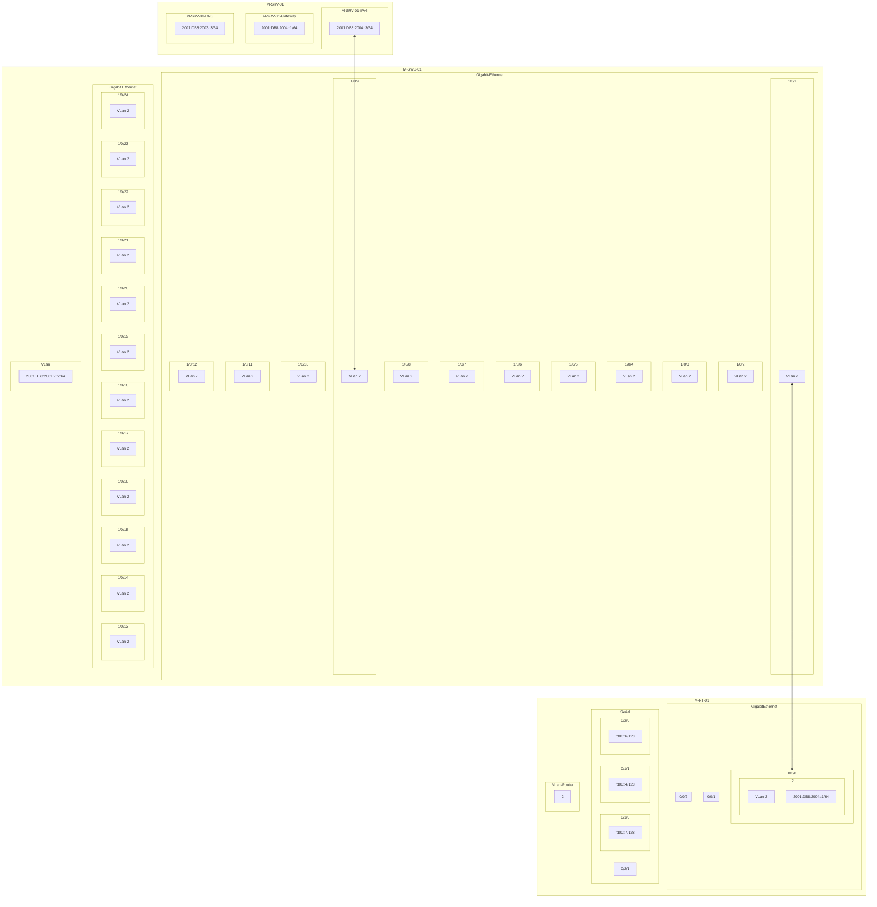
```mermaid
graph TB
    subgraph M-SRV-01
        subgraph M-SRV-01-IPv6
            MSRV01A[2001:DB8:2004::3/64]
        end
        subgraph M-SRV-01-Gateway
            MSRV01B[2001:DB8:2004::1/64]
        end
        subgraph M-SRV-01-DNS
            MSRV01C[2001:DB8:2003::3/64]
        end
    end
    subgraph M-RT-01
        subgraph GigabitEthernet
            subgraph 0/0/0
                subgraph .2
                    MRTB[VLan 2]
                    MRTBIP[2001:DB8:2004::1/64]
                end
            end
            subgraph 0/0/1
            end
            subgraph 0/0/2
            end
        end
        subgraph Serial
            subgraph 0/1/0
              MRTD[fd00::7/128]
            end
            subgraph 0/1/1
              MRTE[fd00::4/128]
            end
            subgraph 0/2/0
              MRTF[fd00::6/128]
            end
            MRTG[0/2/1]
        end
        subgraph VLan-Router
            MRTV2[2]
        end
    end
    subgraph M-SWS-01
        subgraph Gigabit-Ethernet
            subgraph 1/0/1
                MSWSB[VLan 2]
            end
            subgraph 1/0/2
                MSWSC[VLan 2]
            end
            subgraph 1/0/3
                MSWSD[VLan 2]
            end
            subgraph 1/0/4
                MSWSE[VLan 2]
            end
            subgraph 1/0/5
                MSWSF[VLan 2]
            end
            subgraph 1/0/6
                MSWSG[VLan 2]
            end
            subgraph 1/0/7
                MSWSH[VLan 2]
            end
            subgraph 1/0/8
                MSWSI[VLan 2]
            end
            subgraph 1/0/9
                MSWSJ[VLan 2]
            end
            subgraph 1/0/10
                MSWSK[VLan 2]
            end
            subgraph 1/0/11
                MSWSL[VLan 2]
            end
            subgraph 1/0/12
                MSWSM[VLan 2]
            end
        end
        subgraph Gigabit Ethernet
            subgraph 1/0/13
                MSWSN[VLan 2]
            end
            subgraph 1/0/14
                MSWSO[VLan 2]
            end
            subgraph 1/0/15
                MSWSP[VLan 2]
            end
            subgraph 1/0/16
                MSWSQ[VLan 2]
            end
            subgraph 1/0/17
                MSWSR[VLan 2]
            end
            subgraph 1/0/18
                MSWSS[VLan 2]
            end
            subgraph 1/0/19
                MSWST[VLan 2]
            end
            subgraph 1/0/20
                MSWSU[VLan 2]
            end
            subgraph 1/0/21
                MSWSAV[VLan 2]
            end
            subgraph 1/0/22
                MSWSW[VLan 2]
            end
            subgraph 1/0/23
                MSWSAX[VLan 2]
            end
            subgraph 1/0/24
                MSWSY[VLan 2]
            end
        end
        subgraph VLan
            MSWSV2[2001:DB8:2001:2::2/64]
        end
    end
    MSRV01A<-->MSWSJ
    MSWSB<-->0/0/0
```

### Devices

#### Clients

##### M-SRV-01

| Hostname | IPv6                | Device    |
| -------- | ------------------- | --------- |
| M-SRV-01 | 2001:db8:2004::3/64 | Server-PT |

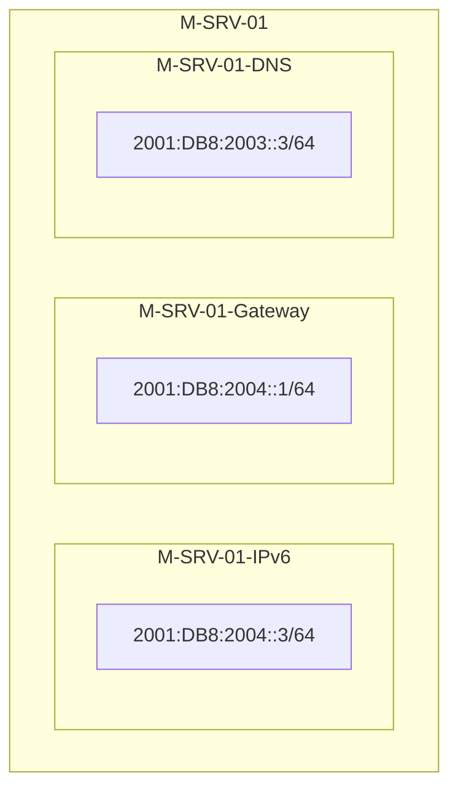
```mermaid
graph TB
    subgraph M-SRV-01
        subgraph M-SRV-01-IPv6
            MSRV01A[2001:DB8:2004::3/64]
        end
        subgraph M-SRV-01-Gateway
            MSRV01B[2001:DB8:2004::1/64]
        end
        subgraph M-SRV-01-DNS
            MSRV01C[2001:DB8:2003::3/64]
        end
    end
```

##### M-SRV-02

| Hostname | IPv6                | Device             |
| -------- | ------------------- | ------------------ |
| M-SRV-02 | 2001:db8:2004::4/64 | Network Controller |

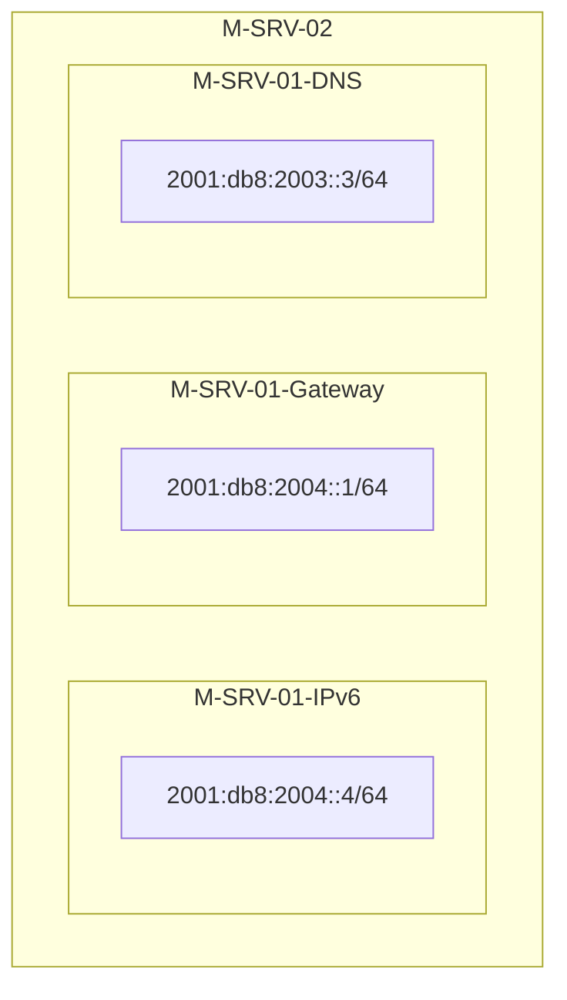
```mermaid
graph TB
    subgraph M-SRV-02
        subgraph M-SRV-01-IPv6
            MSRV02A[2001:db8:2004::4/64]
        end
        subgraph M-SRV-01-Gateway
            MSRV02B[2001:db8:2004::1/64]
        end
        subgraph M-SRV-01-DNS
            MSRV02C[2001:db8:2003::3/64]
        end
    end
```

| Username | Password |
| -------- | -------- |
| noahzmr  | Heyda!   |
| cisco    | Hello!   |

#### M-SWS-01

| Hostname | IPv6                | Device    |
| -------- | ------------------- | --------- |
| M-SWS-01 | 2001:db8:2004::5/64 | 3650-24PS |

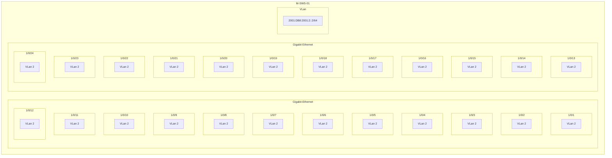
```mermaid
graph TB
    subgraph M-SWS-01
        subgraph Gigabit-Ethernet
            subgraph 1/0/1
                MSWSB[VLan 2]
            end
            subgraph 1/0/2
                MSWSC[VLan 2]
            end
            subgraph 1/0/3
                MSWSD[VLan 2]
            end
            subgraph 1/0/4
                MSWSE[VLan 2]
            end
            subgraph 1/0/5
                MSWSF[VLan 2]
            end
            subgraph 1/0/6
                MSWSG[VLan 2]
            end
            subgraph 1/0/7
                MSWSH[VLan 2]
            end
            subgraph 1/0/8
                MSWSI[VLan 2]
            end
            subgraph 1/0/9
                MSWSJ[VLan 2]
            end
            subgraph 1/0/10
                MSWSK[VLan 2]
            end
            subgraph 1/0/11
                MSWSL[VLan 2]
            end
            subgraph 1/0/12
                MSWSM[VLan 2]
            end
        end
        subgraph Gigabit Ethernet
            subgraph 1/0/13
                MSWSN[VLan 2]
            end
            subgraph 1/0/14
                MSWSO[VLan 2]
            end
            subgraph 1/0/15
                MSWSP[VLan 2]
            end
            subgraph 1/0/16
                MSWSQ[VLan 2]
            end
            subgraph 1/0/17
                MSWSR[VLan 2]
            end
            subgraph 1/0/18
                MSWSS[VLan 2]
            end
            subgraph 1/0/19
                MSWST[VLan 2]
            end
            subgraph 1/0/20
                MSWSU[VLan 2]
            end
            subgraph 1/0/21
                MSWSAV[VLan 2]
            end
            subgraph 1/0/22
                MSWSW[VLan 2]
            end
            subgraph 1/0/23
                MSWSAX[VLan 2]
            end
            subgraph 1/0/24
                MSWSY[VLan 2]
            end
        end
        subgraph VLan
            MSWSV2[2001:DB8:2001:2::2/64]
        end
    end
```

##### Running Config

```sh
!
version 16.3.2
no service timestamps log datetime msec
no service timestamps debug datetime msec
no service password-encryption
!
hostname M-SWS-01
!
enable password cisco123!
!
no ip cef
no ipv6 cef
!
username cisco password 0 cisco123!
username noahzmr password 0 Moin123!
!
ip ssh version 2
ip domain-name noerkelit.online
!
spanning-tree mode pvst
!
interface GigabitEthernet1/0/1
 switchport trunk allowed vlan 2
 switchport mode trunk
!
interface GigabitEthernet1/0/2
 switchport access vlan 2
 switchport trunk allowed vlan 2
 switchport mode access
!
interface GigabitEthernet1/0/3
 switchport access vlan 2
 switchport trunk allowed vlan 2
 switchport mode access
!
interface GigabitEthernet1/0/4
 switchport access vlan 2
 switchport trunk allowed vlan 2
 switchport mode access
!
interface GigabitEthernet1/0/5
 switchport access vlan 2
 switchport trunk allowed vlan 2
 switchport mode access
!
interface GigabitEthernet1/0/6
 switchport access vlan 2
 switchport trunk allowed vlan 2
 switchport mode access
!
interface GigabitEthernet1/0/7
 switchport access vlan 2
 switchport trunk allowed vlan 2
 switchport mode access
!
interface GigabitEthernet1/0/8
 switchport access vlan 2
 switchport trunk allowed vlan 2
 switchport mode access
!
interface GigabitEthernet1/0/9
 switchport access vlan 2
 switchport trunk allowed vlan 2
 switchport mode access
!
interface GigabitEthernet1/0/10
 switchport access vlan 2
 switchport trunk allowed vlan 2
 switchport mode access
!
interface GigabitEthernet1/0/11
 switchport access vlan 2
 switchport trunk allowed vlan 2
 switchport mode access
!
interface GigabitEthernet1/0/12
 switchport access vlan 2
 switchport trunk allowed vlan 2
 switchport mode access
!
interface GigabitEthernet1/0/13
 switchport access vlan 2
 switchport trunk allowed vlan 2
 switchport mode access
!
interface GigabitEthernet1/0/14
 switchport access vlan 2
 switchport trunk allowed vlan 2
 switchport mode access
!
interface GigabitEthernet1/0/15
 switchport access vlan 2
 switchport trunk allowed vlan 2
 switchport mode access
!
interface GigabitEthernet1/0/16
 switchport access vlan 2
 switchport trunk allowed vlan 2
 switchport mode access
!
interface GigabitEthernet1/0/17
 switchport access vlan 2
 switchport trunk allowed vlan 2
 switchport mode access
!
interface GigabitEthernet1/0/18
 switchport access vlan 2
 switchport trunk allowed vlan 2
 switchport mode access
!
interface GigabitEthernet1/0/19
 switchport access vlan 2
 switchport trunk allowed vlan 2
 switchport mode access
!
interface GigabitEthernet1/0/20
 switchport access vlan 2
 switchport trunk allowed vlan 2
 switchport mode access
!
interface GigabitEthernet1/0/21
 switchport access vlan 2
 switchport trunk allowed vlan 2
 switchport mode access
!
interface GigabitEthernet1/0/22
 switchport access vlan 2
 switchport trunk allowed vlan 2
 switchport mode access
!
interface GigabitEthernet1/0/23
 switchport access vlan 2
 switchport trunk allowed vlan 2
 switchport mode access
!
interface GigabitEthernet1/0/24
 switchport access vlan 2
 switchport trunk allowed vlan 2
 switchport mode access
!
interface GigabitEthernet1/1/1
 switchport access vlan 2
 switchport trunk allowed vlan 2
 switchport mode access
!
interface GigabitEthernet1/1/2
 switchport access vlan 2
 switchport trunk allowed vlan 2
 switchport mode access
!
interface GigabitEthernet1/1/3
 switchport access vlan 2
 switchport trunk allowed vlan 2
 switchport mode access
!
interface GigabitEthernet1/1/4
 switchport access vlan 2
 switchport trunk allowed vlan 2
 switchport mode access
!
interface Vlan1
 no ip address
 shutdown
!
interface Vlan2
 mac-address 0007.ec7b.6d01
 ip address 10.0.4.2 255.255.255.0
 ipv6 address 2001:DB8:2004::2/64
!
ip classless
!
ip flow-export version 9
!
banner motd #
********************************************************
*                                                      *
*     Access restricted to authorized personnel        *
*                                                      *
*  This system contains confidential information and   *
*  is intended for authorized users only. Unauthorized *
*  access attempts are strictly prohibited. Changes    *
*  made to the configuration may have implications     *
*  for the company. Ensure that you have the necessary *
*  authorization to make any modifications.            *
*                                                      *
*  All changes must be saved to persist after a        *
*  restart.                                            *
*                                                      *
*  Remember to properly log out when you have          *
*  completed your work.                                *
*                                                      *
********************************************************
#
!
line con 0
 password cisco123!
!
line aux 0
!
line vty 0 4
 transport input ssh
 login local
!
end
```

#### M-RT-01

| Hostname | IPv6                | Port                 | Device  |
| -------- | ------------------- | -------------------- | ------- |
| M-RT-01  | fd00::7/128         | Serial0/1/0          | ISR4331 |
| M-RT-01  | fd00::4/128         | Serial0/1/1          | ISR4331 |
| M-RT-01  | 2001:db8:2004::1/64 | GigabitEthernet0/0/0 | ISR4331 |
| M-RT-01  | fd00::6/128         | Serial0/2/0          | ISR4331 |

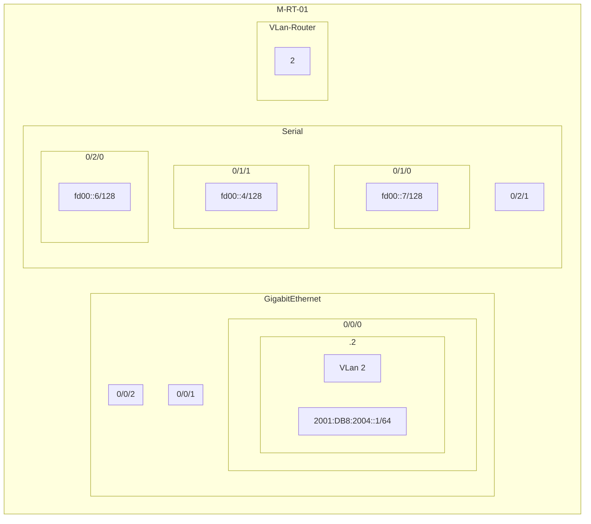
```mermaid
graph TB
    subgraph M-RT-01
        subgraph GigabitEthernet
            subgraph 0/0/0
                subgraph .2
                    MRTB[VLan 2]
                    MRTBIP[2001:DB8:2004::1/64]
                end
            end
            subgraph 0/0/1
            end
            subgraph 0/0/2
            end
        end
        subgraph Serial
            subgraph 0/1/0
              MRTD[fd00::7/128]
            end
            subgraph 0/1/1
              MRTE[fd00::4/128]
            end
            subgraph 0/2/0
              MRTF[fd00::6/128]
            end
            MRTG[0/2/1]
        end
        subgraph VLan-Router
            MRTV2[2]
        end
    end
```

##### Running Config

```sh
!
version 15.4
no service timestamps log datetime msec
no service timestamps debug datetime msec
no service password-encryption
!
hostname M-RT-01
!
enable password cisco123!
!
no ip cef
ipv6 unicast-routing
!
no ipv6 cef
!
username cisco password 0 cisco123!
username noahzmr password 0 Moin123!
!
ip ssh version 1
ip domain-name noerkelit.online
!
spanning-tree mode pvst
!
interface GigabitEthernet0/0/0
 no ip address
 duplex auto
 speed auto
!
interface GigabitEthernet0/0/0.2
 encapsulation dot1Q 2
 ip address 10.0.4.1 255.255.255.0
 ip helper-address 10.0.3.3
 ipv6 address 2001:DB8:2004::1/64
!
interface GigabitEthernet0/0/1
 no ip address
 duplex auto
 speed auto
 shutdown
!
interface GigabitEthernet0/0/2
 no ip address
 duplex auto
 speed auto
 shutdown
!
interface Serial0/1/0
 ip address 192.168.3.2 255.255.255.252
 ipv6 address FD00::7/128
 clock rate 2000000
!
interface Serial0/1/1
 ip address 192.168.5.2 255.255.255.252
 ipv6 address FD00::4/128
 clock rate 2000000
!
interface Serial0/2/0
 ip address 192.168.6.1 255.255.255.252
 ipv6 address FD00::6/128
 clock rate 2000000
!
interface Serial0/2/1
 no ip address
 clock rate 2000000
!
interface Vlan1
 no ip address
 shutdown
!
interface Vlan2
 mac-address 00d0.9785.9701
 no ip address
!
router rip
!
ip classless
ip route 10.0.1.0 255.255.255.192 192.168.3.1
ip route 10.0.2.0 255.255.255.192 192.168.5.1
ip route 10.0.3.0 255.255.255.0 192.168.6.2
ip route 10.0.4.0 255.255.255.0 GigabitEthernet0/0/0.2
ip route 10.0.1.0 255.255.255.0 192.168.3.1
ip route 10.0.2.0 255.255.255.0 192.168.5.1
!
ip flow-export version 9
!
ipv6 route 2001:DB8:2000::/48 Serial0/1/0
ipv6 route 2001:DB8:2001::/48 Serial0/1/1
ipv6 route 2001:DB8:2003::/48 Serial0/2/0
ipv6 route 2001:DB8:2004::/64 GigabitEthernet0/0/0.2
!
banner motd #
********************************************************
*                                                      *
*     Access restricted to authorized personnel        *
*                                                      *
*  This system contains confidential information and   *
*  is intended for authorized users only. Unauthorized *
*  access attempts are strictly prohibited. Changes    *
*  made to the configuration may have implications     *
*  for the company. Ensure that you have the necessary *
*  authorization to make any modifications.            *
*                                                      *
*  All changes must be saved to persist after a        *
*  restart.                                            *
*                                                      *
*  Remember to properly log out when you have          *
*  completed your work.                                *
*                                                      *
********************************************************
#
!
line con 0
 password cisco123!
!
line aux 0
!
line vty 0 4
 transport input ssh
 login local
!
end
```

### Connections

| Port on the M-SWS-01   | Connected to Device | Port from the device  |
| ---------------------- | ------------------- | --------------------- |
| Gigabit Ethernet1/0/1  | M-RT-01             | Gigabit Ethernet0/0/0 |
| Gigabit Ethernet1/0/9  | M-SRV-01            | Fast Ethernet0        |
| Gigabit Ethernet1/0/10 | M-SRV-02            | GigabitEthernet0      |

### VLAN

| Name | ID  | Interface             | Gloable Prefix      |
| ---- | --- | --------------------- | ------------------- |
| M-02 | 2   | Gigabit Ethernet0/0/0 | 2001:db8:2004::2/64 |

## Global


| From Router | Router Port | To Router | Router Port |
| ----------- | ----------- | --------- | ----------- |
| HH-RT-01    | Serial0/1/0 | HL-RT-01  | Serial0/1/0 |
| HH-RT-01    | Serial0/1/1 | B-RT-01   | Serial0/1/0 |
| HH-RT-01    | Serial0/2/0 | M-RT-01   | Serial0/1/0 |
| HL-RT-01    | Serial0/1/1 | B-RT-01   | Serial0/1/1 |
| HL-RT-01    | Serial0/2/0 | M-RT-01   | Serial0/1/1 |
| B-RT-01     | Serial0/2/0 | M-RT-01   | Serial0/2/0 |

### Cable

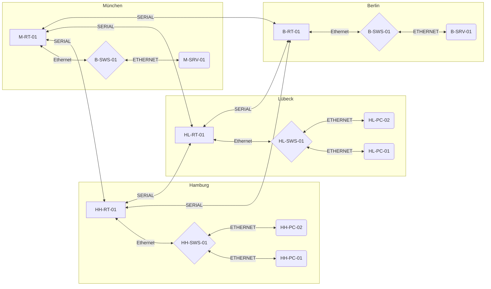
```mermaid
graph LR
    subgraph  Hamburg
        A[HH-RT-01] <-->|Ethernet| B{HH-SWS-01}
        B<-->|ETHERNET| C(HH-PC-01)
        B<-->|ETHERNET| D(HH-PC-02)
    end

    subgraph  Lübeck
        E[HL-RT-01] <-->|Ethernet| F{HL-SWS-01}
        F<-->|ETHERNET| G(HL-PC-01)
        F<-->|ETHERNET| L(HL-PC-02)
    end

    subgraph  Berlin
        H[B-RT-01] <-->|Ethernet| I{B-SWS-01}
        I<-->|ETHERNET| J(B-SRV-01)
    end

    subgraph  München
        M[M-RT-01] <-->|Ethernet| N{B-SWS-01}
        N<-->|ETHERNET| O(M-SRV-01)
    end

    M<-->|SERIAL| A
    M<-->|SERIAL| E
    M<-->|SERIAL| H
    A<-->|SERIAL| H
    A<-->|SERIAL| E
    E<-->|SERIAL| H
```

### IPv6

```mermaid
graph LR

    subgraph Hamburg
        subgraph  HH-RT-01
            subgraph Gigabit Ethernet0/1/0
                A[fd00::0015]
            end
            subgraph Gigabit Ethernet0/1/1
                AB[2001:db8::11]
            end
            subgraph Gigabit Ethernet0/1/2
                AC[fd00::0016]
            end
            subgraph Gigabit Ethernet0/1/3
                AD[fd00::0017]
            end
        end
        subgraph HH-SWS-01
            subgraph Mgmt-HH
                BM[2001:db8::7]
            end

            B1[Gigabit Ethernet1/0/1]
            B2[Gigabit Ethernet1/0/9]
            B3[Gigabit Ethernet1/0/10]
        end
        subgraph HH-PC-01
            subgraph Fast Ethternet0
                C[2001:db8::1]
            end
        end
        subgraph HH-PC-02
            subgraph Fast Ethternet0
                D[2001:db8::2]
            end
        end
            B1 <-->|Standortnetze|A
            B2 <-->|Standortnetze|C
            B3 <-->|Standortnetze|D
    end

    subgraph  Lübeck
        subgraph  HL-RT-01
                subgraph Gigabit Ethernet0/1/0
                    E[fd00::0013]
                end
                subgraph Gigabit Ethernet0/1/1
                    EA[fd00::0012]
                end
                subgraph Gigabit Ethernet0/1/2
                    EB[2001:db8::12]
                end
                subgraph Gigabit Ethernet0/1/3
                    EC[fd00::0011]
                end
        end
        subgraph HL-SWS-01
            subgraph Mgmt-HL
                FM[2001:db8::8]
            end
            F[Gigabit Ethernet1/0/1]
            FA[Gigabit Ethernet1/0/9]
            FC[Gigabit Ethernet1/0/10]
        end
        subgraph HL-PC-01
            subgraph Fast Ethternet0
                G[2001:db8::3]
            end
        end
        subgraph HL-PC-02
            subgraph Fast Ethternet0
                L[2001:db8::4]
            end
        end
            E<-->|Standortnetze|EB
            FA<-->|Standortnetze|G
            FC<-->|Standortnetze|L
    end

    subgraph  Berlin
        subgraph  B-RT-01
            subgraph Gigabit Ethernet0/1/0
                H[fd00::9]
            end
            subgraph Gigabit Ethernet0/1/1
                HA[fd00::8]
            end
            subgraph Gigabit Ethernet0/1/2
                HB[2001:db8::13]
            end
            subgraph Gigabit Ethernet0/1/3
                HC[fd00::0010]
            end
        end
        subgraph B-SWS-01
            subgraph Mgmt-B
                IM[2001:db8::9]
            end
            I[Gigabit Ethernet1/0/1]
            IA[Gigabit Ethernet1/0/10]
        end
        subgraph B-SRV-01
            subgraph Fast Ethternet0
                J[2001:db8::5]
            end
        end
        I<-->|Standortnetze| HB
        IA<-->|Standortnetze| J
    end

    subgraph  München
        subgraph  M-RT-01
            subgraph Gigabit Ethernet0/1/0
                M[fd00::7]
            end
            subgraph Gigabit Ethernet0/1/1
                MA[fd00::4]
            end
            subgraph Gigabit Ethernet0/1/2
                MB[2001:db8::14]
            end
            subgraph Gigabit Ethernet0/1/3
                MC[fd00::6]
            end
        end
        subgraph M-SWS-01
            subgraph Mgmt-M
                NM[2001:db8::10]
            end
            N[Gigabit Ethernet1/0/1]
            NA[Gigabit Ethernet1/0/9]
        end
        subgraph M-SRV-01
            subgraph Fast Ethternet0
                O[2001:db8::6]
            end
        end
        N<-->|Standortnetze|MB
        NA<-->|Standortnetze|O
    end

    M<-->|Transportnetze| A
    M<-->|Transportnetze| E
    M<-->|Transportnetze| H
    A<-->|Transportnetze| H
    A<-->|Transportnetze| E
    E<-->|Transportnetze| H
```

## Commands

### Enable IPv6

```sh
HH-RT-01#enable
HH-RT-01#conf t
Enter configuration commands, one per line.  End with CNTL/Z.
HH-RT-01(config)#ipv6 unicast-routing
HH-RT-01(config)#no ip cef
HH-RT-01(config)#no ip routing
HH-RT-01(config)#end
HH-RT-01#
%SYS-5-CONFIG_I: Configured from console by console
HH-RT-01#write memory
Building configuration...
[OK]
```

### Give a Interface a Static IP

```sh
HH-RT-01#enable
HH-RT-01#conf t
Enter configuration commands, one per line.  End with CNTL/Z.
HH-RT-01(config)#interface Serial0/1/0
HH-RT-01(config-if)#ipv6 address fd00::18/128
HH-RT-01(config)#end
HH-RT-01#
%SYS-5-CONFIG_I: Configured from console by console
HH-RT-01#write memory
Building configuration...
[OK]
```

### Show all IPv6 Address

```sh
HH-RT-01# show ipv6 interface brief

```

### VLan with IPv6 address on a Router

```sh
HH-RT-01# configure terminal
HH-RT-01(config)# vlan <VLan-ID>
HH-RT-01(config-vlan)# name <VLan-Name>
HH-RT-01(config-vlan)# exit
HH-RT-01(config)# interface <Interface-Type> <Interface-Number>.<VLan-ID>
HH-RT-01(config-subif)#encapsulation dot1Q <VLan-ID>
HH-RT-01(config-subif)#exit
HH-RT-01#write memory
Building configuration...
[OK]
```

### Password on a Router

Default Passwords: cisco123!

```sh
HH-RT-01(config)#enable password Hola123!
HH-RT-01(config)#line console 0
HH-RT-01(config-line)#password Adios123!
HH-RT-01(config)#end
HH-RT-01#
%SYS-5-CONFIG_I: Configured from console by console
write memory
Building configuration...
[OK]
```

### Change Password

```sh
HH-RT-01>enable
HH-RT-01#conf t
HH-RT-01(config)no username noahzmr secret
HH-RT-01(config)#username noahzmr password Moin123!
write memory
Building configuration...
[OK]
HH-RT-01#copy running-config startup-config
Destination filename [startup-config]?
Building configuration...
[OK]
```

### Config trunk on a Switch

```sh
SWS-01# configure terminal
SWS-01(config)# interface <Interface Type><Interface-ID>
SWS-01(config-if)# switchport mode trunk
SWS-01(config-if)# switchport trunk allowed vlan <VLan-ID X>,<VLan-ID Y>
SWS-01(config-if)# exit
SWS-01#write memory
Building configuration...
[OK]
```

### Create a Banner

```sh
HH-RT-01#conf t
HH-RT-01(config)# banner motd #
Enter TEXT message.  End with the character '#'.
********************************************************
*                                                      *
*     Access restricted to authorized personnel        *
*                                                      *
*  This system contains confidential information and   *
*  is intended for authorized users only. Unauthorized *
*  access attempts are strictly prohibited. Changes    *
*  made to the configuration may have implications     *
*  for the company. Ensure that you have the necessary *
*  authorization to make any modifications.            *
*                                                      *
*  All changes must be saved to persist after a        *
*  restart.                                            *
*                                                      *
*  Remember to properly log out when you have          *
*  completed your work.                                *
*                                                      *
********************************************************
#
HH-RT-01(config)# exit
```

### Enable SSH

```sh
HH-RT-01>enable
HH-RT-01#configure terminal
HH-RT-01(config)#ip domain-name <domain-name>
HH-RT-01(config)#crypto key generate rsa
HH-RT-01(config)#username <username> privilege 15 secret <password>
HH-RT-01(config)#ip ssh version 2
HH-RT-01(config-line)line vty 0 4
HH-RT-01(config-line)transport input ssh
HH-RT-01(config-line)end
write memory
Building configuration...
[OK]
```

### DHCP Pool connection on a Router

```sh
HH-RT-01>enable
HH-RT-01#conf t
HH-RT-01(config)#interface GigabitEthernet0/0/0.2
HH-RT-01(config-if)#ip helper-address 10.0.3.3
```

### Enable OSPFv3

```sh
HH-RT-01>enable
HH-RT-01#conf t
HH-RT-01(config)#
HH-RT-01(config)#ipv6 unicast-routing
HH-RT-01(config)#router ospf 42
HH-RT-01(config-router)#router-id 1.1.1.1
HH-RT-01(config-router)#exit
HH-RT-01(config)#interface GigabitEthernet0/0/0.2
HH-RT-01(config-subif)#ipv6 ospf 42 area 0
HH-RT-01(config-subif)#end
HH-RT-01#write memory
```

# Keycloak

## What is keycloak?

First of all, what is keycloak?

Keycloak is an open-source identity and access management solution that provides Single Sign-On (SSO) capabilities for web applications and services. It uses open protocols like OpenID Connect, OAuth 2.0, and SAML 2.0 to authenticate and authorize users.

Here's a high-level overview of how Keycloak works:

1. User logs in to an application: When a user tries to log in to an application, they are redirected to the Keycloak authentication server.
2. User authentication: The Keycloak server verifies the user's identity by checking their username and password against the configured authentication provider. This can be a local database, LDAP server, or social login provider like Google or Facebook.
3. Token issuance: Once the user is authenticated, Keycloak issues a token that contains the user's identity and other relevant information like their roles and permissions.
4. Token validation: The application can then use the token to verify the user's identity and authorize them to access protected resources. The token is signed and encrypted to prevent tampering.
5. Logout: When the user logs out of the application, Keycloak revokes the token and logs the user out of all the applications that use Keycloak for authentication.

Keycloak can also act as a central authentication and authorization service for multiple applications, allowing users to access all their resources with a single set of credentials. It provides a user-friendly interface for managing users, roles, and permissions, and can be integrated with popular development frameworks like Spring and Angular.

Simpler said you know how when you go to some websites or apps, you have to type in a username and password to get in? Keycloak is like a helper that makes that process easier and safer.

Instead of having to remember lots of different usernames and passwords for different websites and apps, Keycloak lets you use just one username and password for lots of different places. It's like having a magic key that unlocks lots of doors!

And Keycloak also helps keep your username and password safe. It makes sure that nobody else can steal them or use them without your permission. That way, you can use the internet and your apps without worrying about bad people getting your information.

So Keycloak is like a helpful friend that keeps your information safe and makes things easier for you.

```mermaid
flowchart TD;

subgraph User Application
    A[User] -->|Logs In| B(Keycloak)
    B -->|Grants Access| C[Protected Resource]
end

subgraph Keycloak
    D[Authentication Server] -->|Authenticates User| E[Authorization Server]
    E -->|Issues Tokens| F[User Application]
    F -->|Presents Token| G[Resource Server]
end

subgraph Protected Resource
    G -->|Accesses Resource| H[Protected Resource]
end
```

Keycloak has a feature called Social provider, this allows users to authenticate with their social media accounts, such as Facebook, Google, or Twitter, instead of creating a new username and password for each application they use. This provides a convenient and streamlined way for users to access multiple applications while maintaining their existing social media account information.

To use a social provider with Keycloak, you first need to configure the provider in the Keycloak Administration Console. This involves creating a new identity provider, providing the necessary configuration details, and optionally specifying the required scopes, roles, and mappers.

Once the social provider is configured, users can log in to the application using their social media account credentials. To do this, they select the social provider button on the application's login page, which redirects them to the corresponding social media login page. After the user successfully logs in to their social media account, the social media provider generates an access token and sends it back to Keycloak. Keycloak then verifies the access token, creates a new Keycloak user, and issues an access token and refresh token for the user.

After the user has successfully authenticated with the social provider, they can use the application just like any other user. The application can also use the Keycloak APIs to access the user's social media account information, such as their profile picture, email address, or friends list.

Overall, social provider is a convenient and secure way for users to authenticate with multiple applications using their existing social media accounts, while also allowing applications to access their social media information through Keycloak APIs.

```mermaid
flowchart TD;

subgraph Application
    A[Login Page] -->|Social Login| B[Social Media Provider]
    B -->|Access Token| C(Keycloak)
    C -->|Access Token| D[Application]
end

subgraph Keycloak
    E[Identity Provider] -->|Configures Provider| F[Keycloak]
    F -->|Authenticates User| G[Social Media Provider]
    G -->|Access Token| F
    F -->|Issues Tokens| D
end

```

## Groups and Roles

The app has two keycloak groups, each assigned a role, with the role name corresponding to the group name. This is done to ensure that not everyone can access all resources. Routes in the backend are assigned to these roles so that only people who are part of the group/role can access the resource. To use the app, one must be a member of the `sdn_cisco_member` group. If one wants to make changes to the connections, such as the Azure, Keycloak, or Hue endpoint, one must be a member of the `sdn_cisco_admin` group.

```mermaid
graph TD;
    Application --> sdn_cisco_admin
    Application --> sdn_cisco_member
    sdn_cisco_admin -->|has role| sdn_cisco_admin_Role
    sdn_cisco_member -->|has role| sdn_cisco_member_Role
    sdn_cisco_admin_Role --> |allow to go|Get
    sdn_cisco_admin_Role -->|allow to go| Delete
    sdn_cisco_admin_Role -->|allow to go| Put
    sdn_cisco_admin_Role -->|allow to go| Post
```

Of course, the routes in the React app are also protected. This is also done via Keycloak and the realm roll with the following function.

```jsx
import React from 'react'
import { Navigate } from 'react-router-dom'
import { KeycloakContext } from './keycloak'
import { useContext } from 'react'
import PropTypes from 'prop-types'

const checkRole = (roles, role) => {
  console.warn('ROLES: ', roles, role, roles.includes(role[0]) || roles.includes(role[1]))
  return roles.includes(role[0]) || roles.includes(role[1])
}

const PrivateRoute = ({ component: Component, roles }) => {
  PrivateRoute.propTypes = {
    component: PropTypes.any.isRequired,
    roles: PropTypes.any.isRequired
  }

  const kcContext = useContext(KeycloakContext)
  const kc = kcContext.keycloak
  const realmAccess = kc.realmAccess.roles
  if (kc.authenticated && checkRole(realmAccess, roles)) {
    return Component
  } else {
    return <Navigate to={{ pathname: '/403' }} />
  }
}

export default PrivateRoute
```

The function is called randomly in the router:

```jsx
<Route
  path="/config"
  element={
    <PrivateRoute exact path="/config" component={<Config />} roles={['sdn_cisco_admin']} />
  }
/>
```

```mermaid
graph TD;
  A[Router] --> B[Route];
  B --> C[PrivateRoute];
  C --> D[Component];
  C --> E[Navigate];
  C --> F[checkRole];
  F -->|Input| G{realmAccess, roles};
  F -->|Output| H[boolean];
  C --> I[KeycloakContext];
  I --> J[keycloak];
  J --> K[authenticated];
  K -->|Input| L["realmAccess, roles"];
  K --> M[Component];
  L --> F;
  K -->|Output| N[boolean];
  N -->|Input| F;
  N -->|Output| O[Navigate / Component];
```

# Prometheus

Prometheus is an open source monitoring and alerting system. It was originally developed by SoundCloud and is part of the Cloud Native Computing Foundation project. Prometheus is designed to collect, store and analyze high-dimensional time series data. It can be used in various applications to collect metrics and events, monitor performance indicators, and generate alerts as needed.

Here are some important concepts and features of Prometheus:

- Metrics and Time Series Data: Prometheus collects and stores metrics as time series data. A time series is a sequential collection of metric values that are time-stamped. Typical metrics include CPU usage, memory usage, request rate, latency, etc.

- Scraping and Pull Model: Prometheus uses the pull model to retrieve metrics from targets to be monitored. It provides its own web server that periodically retrieves metrics from the endpoints (e.g., applications, services, or systems). Endpoints must provide metrics via a defined HTTP interface.

- PromQL: Prometheus provides its own query language called PromQL (Prometheus Query Language). PromQL allows you to perform complex queries and aggregations over the collected metrics. For example, you can calculate averages, sums, histograms, and quantiles.

- Data Model and Labeling: Prometheus uses a flexible data model that allows you to assign labels to metrics. Labels are key-value pairs that provide additional information about the metrics. They can be used to identify, filter, and group metrics, enabling powerful data analysis.

- Alerting and notifications: Prometheus has a built-in alerting system that allows you to define alerting rules. You can set rules based on metrics and thresholds, and trigger actions such as triggering notifications or running scripts on alert conditions.

- Integration capabilities: Prometheus can integrate with a variety of tools and systems. It offers numerous exporters that can extract metrics from common applications and systems. There are also a variety of libraries and integrations for different programming languages and frameworks.

Prometheus is particularly well suited for cloud-native environments using containers, microservices and scalable infrastructures. It provides a robust solution for monitoring applications and infrastructure to optimize performance, detect bottlenecks, and identify potential problems early.

# Grafana

Grafana is an open source platform for data visualization and monitoring. It provides a user-friendly interface for creating interactive dashboards, charts and alarms to analyze and display data from various sources. Grafana enables users to transform complex data into meaningful graphs and charts to gain insights into the health, performance and trends of systems, applications and infrastructure.

Here are some key features and functions of Grafana:

- Data source integration: Grafana supports a wide range of data sources, including time series databases such as Prometheus, InfluxDB, Graphite and Elasticsearch, SQL databases, cloud platforms such as AWS CloudWatch and Azure Monitor, and many other APIs and protocols. By integrating multiple data sources, users can merge data from different sources and visualize it in a single dashboard.

- Dashboard creation: Grafana allows users to create dashboards to visually represent their data. The user interface offers a variety of chart types, such as line charts, bar charts, pie charts, time series charts, and many others. Users can customize their dashboards by adding, arranging, scaling and formatting charts to achieve the desired display. There are also a number of widgets and panels that allow users to present data in tables, charts, heat maps, bar graphs and other forms.

- Query and filtering capabilities: Grafana provides a powerful query language that allows users to filter, aggregate and transform data. Users can create complex queries to retrieve and visualize specific data from their data sources. The query language supports functions such as grouping, filtering, aggregation, mathematical operations and more.

- Alerting and Notification: Grafana allows users to define alert rules to respond to specific conditions or thresholds in the data. When an alert rule is triggered, Grafana can send notifications via email, Slack, PagerDuty and other channels to notify users of the alert condition. This allows users to proactively respond to issues and take action.

- Community and integrations: Grafana has an active user and developer community and offers a variety of integrations, extensions and plugins. There is a wide range of pre-built dashboards and templates shared by the community to facilitate monitoring and visualization of specific systems and services. Users can also develop their own plugins or use existing plugins to extend Grafana's functionality.

Grafana has become a standard tool in the world of monitoring and data visualization.

## Dashboard


```json
{
  "annotations": {
    "list": [
      {
        "builtIn": 1,
        "datasource": {
          "type": "grafana",
          "uid": "-- Grafana --"
        },
        "enable": true,
        "hide": true,
        "iconColor": "rgba(0, 211, 255, 1)",
        "name": "Annotations & Alerts",
        "type": "dashboard"
      }
    ]
  },
  "description": "Show the Data from the SDN Controller",
  "editable": true,
  "fiscalYearStartMonth": 0,
  "graphTooltip": 0,
  "id": 6,
  "links": [],
  "liveNow": false,
  "panels": [
    {
      "datasource": {
        "type": "prometheus",
        "uid": "PBFA97CFB590B2093"
      },
      "description": "Count of Discoverys",
      "fieldConfig": {
        "defaults": {
          "color": {
            "mode": "thresholds"
          },
          "mappings": [],
          "thresholds": {
            "mode": "absolute",
            "steps": [
              {
                "color": "green",
                "value": null
              },
              {
                "color": "red",
                "value": 80
              }
            ]
          }
        },
        "overrides": []
      },
      "gridPos": {
        "h": 8,
        "w": 12,
        "x": 0,
        "y": 0
      },
      "id": 2,
      "options": {
        "orientation": "auto",
        "reduceOptions": {
          "calcs": [
            "lastNotNull"
          ],
          "fields": "",
          "values": false
        },
        "showThresholdLabels": false,
        "showThresholdMarkers": true
      },
      "pluginVersion": "9.5.2",
      "targets": [
        {
          "datasource": {
            "type": "prometheus",
            "uid": "PBFA97CFB590B2093"
          },
          "editorMode": "builder",
          "expr": "discovery_count",
          "legendFormat": "__auto",
          "range": true,
          "refId": "A"
        }
      ],
      "title": "Discoverys",
      "type": "gauge"
    },
    {
      "collapsed": false,
      "gridPos": {
        "h": 1,
        "w": 24,
        "x": 0,
        "y": 8
      },
      "id": 7,
      "panels": [],
      "title": "Network Health",
      "type": "row"
    },
    {
      "datasource": {
        "type": "prometheus",
        "uid": "PBFA97CFB590B2093"
      },
      "description": "Health percentage of network devices",
      "fieldConfig": {
        "defaults": {
          "color": {
            "mode": "palette-classic"
          },
          "custom": {
            "axisCenteredZero": false,
            "axisColorMode": "text",
            "axisLabel": "",
            "axisPlacement": "auto",
            "barAlignment": 0,
            "drawStyle": "line",
            "fillOpacity": 8,
            "gradientMode": "none",
            "hideFrom": {
              "legend": false,
              "tooltip": false,
              "viz": false
            },
            "lineInterpolation": "linear",
            "lineWidth": 2,
            "pointSize": 4,
            "scaleDistribution": {
              "type": "linear"
            },
            "showPoints": "auto",
            "spanNulls": false,
            "stacking": {
              "group": "A",
              "mode": "none"
            },
            "thresholdsStyle": {
              "mode": "off"
            }
          },
          "mappings": [],
          "max": 100,
          "thresholds": {
            "mode": "absolute",
            "steps": [
              {
                "color": "red",
                "value": null
              },
              {
                "color": "green",
                "value": 80
              }
            ]
          },
          "unit": "percent"
        },
        "overrides": []
      },
      "gridPos": {
        "h": 8,
        "w": 12,
        "x": 0,
        "y": 9
      },
      "id": 5,
      "options": {
        "legend": {
          "calcs": [],
          "displayMode": "list",
          "placement": "bottom",
          "showLegend": true
        },
        "tooltip": {
          "mode": "single",
          "sort": "none"
        }
      },
      "targets": [
        {
          "datasource": {
            "type": "prometheus",
            "uid": "PBFA97CFB590B2093"
          },
          "editorMode": "builder",
          "expr": "Cisco_Healthy_Clients",
          "legendFormat": "{{__name__}}",
          "range": true,
          "refId": "Clients"
        },
        {
          "datasource": {
            "type": "prometheus",
            "uid": "PBFA97CFB590B2093"
          },
          "editorMode": "builder",
          "expr": "Cisco_Healthy_Network_Devices",
          "hide": false,
          "legendFormat": "{{__name__}}",
          "range": true,
          "refId": "Network Devices"
        }
      ],
      "title": "Health Network Devices",
      "type": "timeseries"
    },
    {
      "datasource": {
        "type": "prometheus",
        "uid": "PBFA97CFB590B2093"
      },
      "description": "Count of Health Issues",
      "fieldConfig": {
        "defaults": {
          "color": {
            "mode": "thresholds"
          },
          "mappings": [],
          "thresholds": {
            "mode": "absolute",
            "steps": [
              {
                "color": "green",
                "value": null
              },
              {
                "color": "red",
                "value": 80
              }
            ]
          }
        },
        "overrides": []
      },
      "gridPos": {
        "h": 8,
        "w": 12,
        "x": 12,
        "y": 9
      },
      "id": 3,
      "options": {
        "orientation": "auto",
        "reduceOptions": {
          "calcs": [
            "lastNotNull"
          ],
          "fields": "",
          "values": false
        },
        "showThresholdLabels": false,
        "showThresholdMarkers": true
      },
      "pluginVersion": "9.5.2",
      "targets": [
        {
          "datasource": {
            "type": "prometheus",
            "uid": "PBFA97CFB590B2093"
          },
          "editorMode": "builder",
          "expr": "health_issues_count",
          "legendFormat": "__auto",
          "range": true,
          "refId": "A"
        }
      ],
      "title": "Health Issues",
      "type": "gauge"
    },
    {
      "collapsed": false,
      "gridPos": {
        "h": 1,
        "w": 24,
        "x": 0,
        "y": 17
      },
      "id": 6,
      "panels": [],
      "title": "Network Devices",
      "type": "row"
    },
    {
      "datasource": {
        "type": "prometheus",
        "uid": "PBFA97CFB590B2093"
      },
      "fieldConfig": {
        "defaults": {
          "color": {
            "mode": "palette-classic"
          },
          "custom": {
            "hideFrom": {
              "legend": false,
              "tooltip": false,
              "viz": false
            }
          },
          "mappings": [],
          "unit": "none"
        },
        "overrides": []
      },
      "gridPos": {
        "h": 8,
        "w": 12,
        "x": 0,
        "y": 18
      },
      "id": 9,
      "options": {
        "displayLabels": [
          "percent",
          "value"
        ],
        "legend": {
          "displayMode": "list",
          "placement": "bottom",
          "showLegend": true,
          "values": []
        },
        "pieType": "pie",
        "reduceOptions": {
          "calcs": [
            "lastNotNull"
          ],
          "fields": "",
          "values": false
        },
        "tooltip": {
          "mode": "single",
          "sort": "none"
        }
      },
      "targets": [
        {
          "datasource": {
            "type": "prometheus",
            "uid": "PBFA97CFB590B2093"
          },
          "editorMode": "builder",
          "expr": "Cisco_Router",
          "legendFormat": "{{__name__}}",
          "range": true,
          "refId": "Router"
        },
        {
          "datasource": {
            "type": "prometheus",
            "uid": "PBFA97CFB590B2093"
          },
          "editorMode": "builder",
          "exemplar": false,
          "expr": "Cisco_Switches",
          "hide": false,
          "instant": false,
          "interval": "",
          "legendFormat": "{{__name__}}",
          "range": true,
          "refId": "Switches"
        }
      ],
      "title": "Panel Title",
      "type": "piechart"
    },
    {
      "datasource": {
        "type": "prometheus",
        "uid": "PBFA97CFB590B2093"
      },
      "description": "Count of Network Devices",
      "fieldConfig": {
        "defaults": {
          "color": {
            "mode": "thresholds"
          },
          "mappings": [],
          "thresholds": {
            "mode": "absolute",
            "steps": [
              {
                "color": "green",
                "value": null
              },
              {
                "color": "red",
                "value": 80
              }
            ]
          }
        },
        "overrides": []
      },
      "gridPos": {
        "h": 8,
        "w": 12,
        "x": 12,
        "y": 18
      },
      "id": 1,
      "options": {
        "orientation": "auto",
        "reduceOptions": {
          "calcs": [
            "lastNotNull"
          ],
          "fields": "",
          "values": false
        },
        "showThresholdLabels": false,
        "showThresholdMarkers": true
      },
      "pluginVersion": "9.5.2",
      "targets": [
        {
          "datasource": {
            "type": "prometheus",
            "uid": "PBFA97CFB590B2093"
          },
          "editorMode": "builder",
          "expr": "network_device_count",
          "legendFormat": "__auto",
          "range": true,
          "refId": "A"
        }
      ],
      "title": "Network Devices",
      "type": "gauge"
    },
    {
      "datasource": {
        "type": "prometheus",
        "uid": "PBFA97CFB590B2093"
      },
      "fieldConfig": {
        "defaults": {
          "color": {
            "mode": "thresholds"
          },
          "mappings": [],
          "thresholds": {
            "mode": "absolute",
            "steps": [
              {
                "color": "green",
                "value": null
              },
              {
                "color": "red",
                "value": 80
              }
            ]
          }
        },
        "overrides": []
      },
      "gridPos": {
        "h": 8,
        "w": 12,
        "x": 0,
        "y": 26
      },
      "id": 10,
      "options": {
        "orientation": "auto",
        "reduceOptions": {
          "calcs": [
            "lastNotNull"
          ],
          "fields": "",
          "values": false
        },
        "showThresholdLabels": false,
        "showThresholdMarkers": true
      },
      "pluginVersion": "9.5.2",
      "targets": [
        {
          "datasource": {
            "type": "prometheus",
            "uid": "PBFA97CFB590B2093"
          },
          "editorMode": "builder",
          "expr": "Cisco_Unrechable",
          "legendFormat": "__auto",
          "range": true,
          "refId": "A"
        }
      ],
      "title": "Unreachable Devices",
      "type": "gauge"
    }
  ],
  "refresh": "",
  "schemaVersion": 38,
  "style": "dark",
  "tags": [
    "SDN",
    "nodejs",
    "cisco"
  ],
  "templating": {
    "list": []
  },
  "time": {
    "from": "now-6h",
    "to": "now"
  },
  "timepicker": {},
  "timezone": "",
  "title": "SDN",
  "uid": "f6cb53b9-0752-4033-ad4f-402477eae5b9",
  "version": 11,
  "weekStart": ""
}
```

# Sonarqube

SonarQube is a self-managed, automatic code review tool that systematically helps you deliver clean code
It automatically runs once a day, one pass, if successful a Docker image is built and published. The piepline can also be triggered manually.


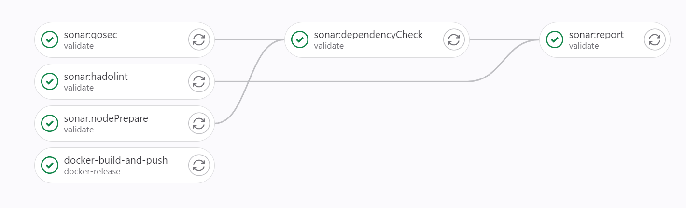
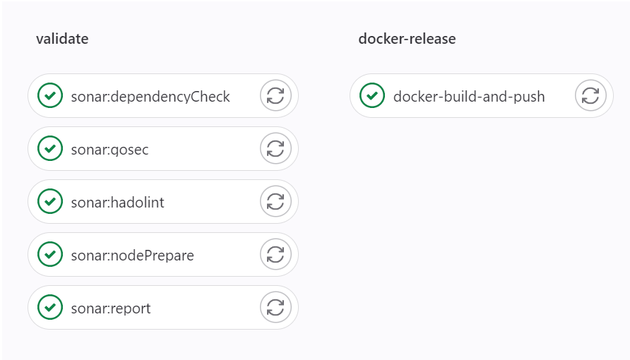
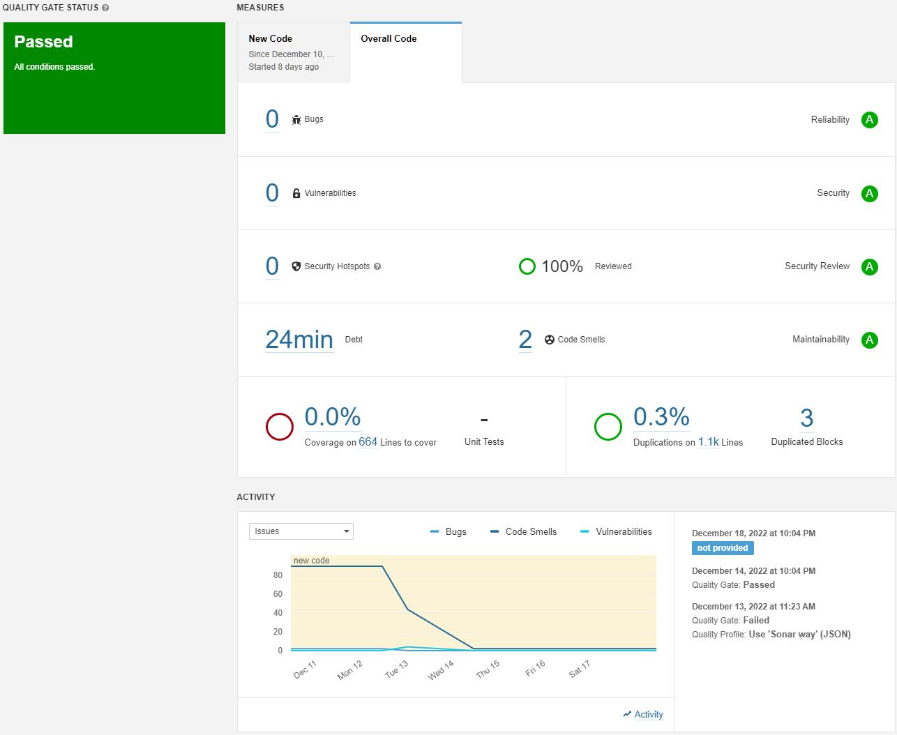

| What?             | Short description                                                                                                                                                                                      |
| ----------------- | ------------------------------------------------------------------------------------------------------------------------------------------------------------------------------------------------------ |
| Bugs              | A coding mistake that can lead to an error or unexpected behavior at runtime.                                                                                                                          |
| Vulnerability     | A point in your code that's open to attack.                                                                                                                                                            |
| Code Smell        | A maintainability issue that makes your code confusing and difficult to maintain.                                                                                                                      |
| Security hotspots | A security hotspot highlights a security-sensitive piece of code that the developer needs to review. Upon review, you'll either find there is no threat or you need to apply a fix to secure the code. |
| New Code          | Displays only things that were added during the last pass                                                                                                                                              |
| Quality gates     | Quality gates enforce a quality policy in your organization by answering one question: is my project ready for release?                                                                                |

## UI

[](https://sonarqube.autonubil.net/dashboard?id=sdn_cisco_ui)

[](https://sonarqube.autonubil.net/dashboard?id=sdn_cisco_ui)

[](https://sonarqube.autonubil.net/dashboard?id=sdn_cisco_ui)

[](https://sonarqube.autonubil.net/dashboard?id=sdn_cisco_ui)

[](https://sonarqube.autonubil.net/dashboard?id=sdn_cisco_ui)

## Server

[](https://sonarqube.autonubil.net/dashboard?id=sdn_cisco_lf9)

[](https://sonarqube.autonubil.net/dashboard?id=sdn_cisco_lf9)

[](https://sonarqube.autonubil.net/dashboard?id=sdn_cisco_lf9)

[](https://sonarqube.autonubil.net/dashboard?id=sdn_cisco_lf9)

[](https://sonarqube.autonubil.net/dashboard?id=sdn_cisco_lf9)

# Sentry

Sentry is an open source platform for error monitoring and error logging management. It provides developers and development teams with a way to capture, track, and analyze errors and exceptions in their applications.

With Sentry, developers can identify and diagnose errors in real time to improve the stability and reliability of their applications. The platform supports a variety of programming languages and frameworks, including Python, JavaScript, Java, Ruby, PHP and many more.

Sentry's main features include:

Error monitoring: Sentry automatically captures errors and exceptions in applications and provides detailed information about the error, including stack tracking, environment variables, request data and user information.

Error reporting: Sentry generates reports on captured errors that help developers understand and resolve root causes. These reports include useful information such as when the error occurred, the application version affected, and what triggered the error.

Bug tracking: Sentry tracks bugs across different versions of an application. This allows developers to analyze the impact of changes in code or infrastructure on error frequency.

Notifications: Sentry sends notifications of new bugs or exceptions via email, chat, or other channels. This allows developers to quickly respond to issues and take action.

Integrations: Sentry provides integrations with other tools and services such as issue tracking systems (e.g., JIRA), developer tools (e.g., GitHub), and chat platforms (e.g., Slack). This allows bugs to be seamlessly integrated into the development workflow.

By using Sentry, developers can improve the quality of their software, optimize the user experience, and accelerate development cycles by quickly identifying and fixing bugs. The platform is available in both a cloud version and as a self-hosted solution to meet the diverse needs of enterprises.

# Glossar

## IPv6

IPv6 stands for Internet Protocol Version 6 and is the latest version of the Internet Protocol used to identify and locate devices on the Internet. It was developed to overcome the limited number of IP addresses in IPv4.

IPv4 uses 32-bit addresses, which means that only about 4.3 billion unique addresses are available. As the number of devices connecting to the Internet increased, these addresses became scarce. IPv6, on the other hand, uses 128-bit addresses, providing a significantly larger number of possible addresses, about 340 sextillion (3.4 × 10^38).

IPv6 offers other improvements over IPv4 in addition to the larger number of addresses. These include improved security, automatic configuration of network devices, simplified network expansion, improved quality-of-service features, and simplified routing.

Another important feature of IPv6 is support for IPv6 packets, which allow for larger data units than IPv4. This can lead to more efficient transmission of data.

Although IPv6 has been available for many years, it is not as widely used as IPv4. This is partly because many older devices and network infrastructures only support IPv4. However, there is an increasing push to move to IPv6 to meet the growing demand for IP addresses and to meet the future needs of the Internet.

## Unique Local Unicast addresses

Unique Local Unicast (ULA) addresses are a type of IPv6 address that is used for local communication within a private network or organization. They are similar to private IP addresses in IPv4, such as those starting with "10.0.0.0/8," "172.16.0.0/12," or "192.168.0.0/16."

ULA addresses are designed to be globally unique within an organization or site but are not globally routable on the internet. They provide a way to assign and communicate with devices within a closed network without requiring public internet connectivity.

ULA addresses have the following format: fd00::/8. The 8-bit prefix "fd" identifies ULA addresses, followed by a 40-bit randomly generated Global ID, and a 16-bit Subnet ID. The Global ID should be unique within the organization or site, while the Subnet ID can be used for further subnetting within the network.

ULA addresses can be used in various scenarios, such as:

1. Private networks: Organizations can use ULA addresses to assign unique addresses to devices within their internal networks, ensuring uniqueness and avoiding conflicts with public IP addresses.

2. Local communication: ULA addresses enable devices within a private network to communicate with each other without the need for internet connectivity. They facilitate local services and internal communication.

3. VPNs (Virtual Private Networks): ULA addresses can be used within a VPN infrastructure to assign unique addresses to VPN clients and facilitate secure communication within the VPN network.

It's important to note that ULA addresses should not be used for communication over the public internet. If devices with ULA addresses need to access the internet, network address translation (NAT) or other mechanisms are required to translate the ULA addresses into globally routable IP addresses.

## Global Unicast addresses

Global Unicast addresses are a type of IPv6 address that is globally routable on the internet. They are the equivalent of public IP addresses in IPv4. Global Unicast addresses allow devices to communicate with each other across the internet, making them globally reachable.

Global Unicast addresses in IPv6 have a 128-bit format and are structured into different blocks. The first 3 bits of the address are always set to "001," indicating that it is a Global Unicast address. The next 45 bits are used for the Internet Service Provider (ISP) prefix, which is assigned by regional Internet registries. The remaining 80 bits are available for addressing individual devices or subnets within the ISP's allocation.

Global Unicast addresses are unique on a global scale, ensuring that there are no address conflicts. They provide a virtually limitless number of addresses compared to the limited address space of IPv4.

When a device with a Global Unicast address wants to communicate with another device on the internet, it uses routing protocols to determine the best path for sending packets to the destination address. Routers in the network infrastructure use the information in the IPv6 address to forward packets towards the intended destination.

Global Unicast addresses play a crucial role in enabling global connectivity and communication over the internet. They allow devices from different networks and locations to exchange data, access online services, and participate in various internet-based activities.

In addition to global reachability, Global Unicast addresses also provide enhanced features and capabilities, such as improved security and support for advanced IPv6 features like flow labeling and mobility.

Overall, Global Unicast addresses are fundamental to the functioning of IPv6 and are essential for enabling global internet communication in the modern networked world.

## Provider Independent Address Space

Provider Independent Address Space (PI address space) refers to a block of IP addresses that is allocated to an organization or entity directly by a Regional Internet Registry (RIR). Unlike Provider Assigned Address Space (PA address space), which is assigned by an Internet Service Provider (ISP) for their customers' use, PI address space is independent of any specific ISP or network service provider.

PI address space provides organizations with more flexibility and control over their IP addressing. It allows them to change ISPs or connect to multiple ISPs without having to renumber their entire network infrastructure. This independence is particularly valuable for large enterprises, organizations with multi-homed network connections, or those requiring a high level of autonomy over their IP addressing.

To obtain PI address space, an organization typically needs to meet certain criteria set by the RIR, such as demonstrating a valid technical need and having a plan for efficient address utilization. The allocation process involves submitting a request to the RIR and going through an evaluation and verification process.

Once allocated, the organization becomes the custodian of the PI address space and is responsible for managing and routing the IP addresses within their network infrastructure. They can assign IP addresses to their devices, subnets, or other network elements as per their requirements.

It's important to note that PI address space is relatively scarce and valuable, and the allocation policies and procedures may vary among different RIRs. Additionally, the management and advertisement of PI address space on the internet require coordination and appropriate routing configurations to ensure proper connectivity and reachability across different networks.

Overall, PI address space provides organizations with greater autonomy and flexibility in managing their IP addressing needs, allowing them to have direct control over their network infrastructure and connectivity choices.

## VLAN

VLAN stands for Virtual Local Area Network. It is a technology used in computer networking to logically divide a single physical network into multiple virtual networks. VLANs provide several benefits, including improved network performance, increased security, and better network management.

In a traditional network, devices within the same physical LAN are part of the same broadcast domain. This means that all devices receive broadcast packets sent by any other device in the LAN. VLANs address this limitation by allowing network administrators to group devices together based on logical criteria, regardless of their physical location. These logical groups of devices are known as VLANs.

Here are some key points about VLANs:

1. Logical segmentation: VLANs enable the creation of multiple logical networks within a single physical network. Devices in different VLANs can communicate with each other as if they were on separate physical networks, even if they are physically connected to the same switch.

2. Broadcast isolation: Devices within a VLAN only receive broadcast traffic intended for their VLAN. This reduces the amount of unnecessary broadcast traffic on the network and improves overall network performance.

3. Security: VLANs can be used to enhance network security by isolating sensitive or critical devices from the rest of the network. This helps to prevent unauthorized access and reduces the impact of security breaches.

4. Flexibility and scalability: VLANs provide flexibility in network design and allow for easier network expansion. New VLANs can be created and configured without the need for additional physical cabling or network infrastructure changes.

5. VLAN tagging: To identify VLAN membership, a technique called VLAN tagging is used. It adds a VLAN identifier (VLAN ID) to Ethernet frames, indicating which VLAN the frame belongs to. This allows switches and other network devices to properly direct traffic to the correct VLANs.

VLANs are commonly implemented in enterprise networks, data centers, and service provider networks. They are configured and managed through network switches, which support VLAN functionality. Network administrators can assign ports on switches to specific VLANs or use other methods such as VLAN trunking to carry multiple VLANs over a single network link.

Overall, VLANs provide a flexible and efficient way to partition a network, improve network performance, and enhance network security by logically separating devices into virtual networks.

## Trunk

A trunk is a connection between network devices (for example, switches or routers) that is used to transport multiple VLANs. Unlike access ports, which only allow traffic for a specific VLAN, a trunk port allows traffic for multiple VLANs to pass over a single physical connection.

Here are some important features of a trunk:

**VLAN tags**: Trunk ports use VLAN tags to identify traffic for each VLAN. Each packet transmitted over the trunk port contains a VLAN tag that indicates which VLAN it belongs to.

**802.1Q protocol**: The 802.1Q protocol is the most commonly used protocol to insert VLAN tags into Ethernet frames. It adds an additional field to the Ethernet header that contains the VLAN tag.

**VLAN membership**: a trunk port can either allow all VLANs (all VLANs mode) or only certain VLANs (allowed VLANs mode). The allowed VLANs are configured to ensure that only the desired traffic is transmitted over the trunk port.

**Bandwidth aggregation**: a trunk allows multiple physical connections to be bundled into one logical connection. This is called bandwidth aggregation and increases the overall capacity of the connection.

Trunk ports play an important role in networks with multiple VLANs because they enable the efficient transfer of traffic between VLANs and make the best use of bandwidth. They provide flexibility and scalability in managing network traffic.

## Prefix

In the context of networking and IP addressing, a prefix refers to the portion of an IP address that indicates the network or subnet to which a device belongs. It is also known as the network prefix or network portion.

An IP address consists of two parts: the network prefix and the host identifier. The network prefix identifies the network to which the device is connected, while the host identifier specifies the specific device within that network.

In IPv4, the network prefix is represented by the subnet mask, which is a 32-bit value that indicates the number of bits used for the network portion. For example, in the IP address 192.168.0.1 with a subnet mask of 255.255.255.0, the first 24 bits (3 bytes) represent the network prefix (192.168.0), and the remaining 8 bits (1 byte) represent the host identifier (1).

In IPv6, the network prefix is specified using CIDR (Classless Inter-Domain Routing) notation. It consists of a network address followed by a slash (/) and the prefix length. For example, in the IPv6 address 2001:0db8:85a3:0000:0000:8a2e:0370:7334/64, the first 64 bits (8 groups of 4 hexadecimal digits) represent the network prefix, and the remaining 64 bits represent the host identifier.

The prefix length indicates the number of bits in the network prefix. It determines the size of the network and the number of available host addresses. A smaller prefix length represents a larger network with more available host addresses, while a larger prefix length represents a smaller network with fewer available host addresses.

Network administrators use prefixes to configure and manage IP networks, subnetting, and routing. By properly assigning and configuring prefixes, they can efficiently allocate IP addresses, divide networks into subnets, and ensure proper routing of network traffic.

Overall, the prefix is a fundamental concept in IP addressing that helps identify the network or subnet associated with an IP address and plays a crucial role in network configuration, subnetting, and routing.

## L3 switches

L3 switches, also known as Layer 3 switches or multilayer switches, are network devices that combine the functionalities of traditional Layer 2 switches and Layer 3 routers. They operate at both Layer 2 (data link layer) and Layer 3 (network layer) of the OSI (Open Systems Interconnection) model, allowing them to perform switching and routing functions within a single device.

Here are some key characteristics and features of L3 switches:

1. Switching and routing: L3 switches can perform both switching and routing functions. They can switch traffic between devices within the same VLAN or subnet at Layer 2, just like traditional Layer 2 switches. Additionally, they can route traffic between different VLANs or subnets at Layer 3, similar to routers.

2. Fast packet forwarding: L3 switches are designed for high-speed packet forwarding. They use specialized hardware and caching mechanisms to quickly analyze and forward network traffic, improving network performance.

3. VLAN support: L3 switches often provide extensive support for virtual LANs (VLANs). They allow for the creation, management, and inter-VLAN routing of multiple VLANs, providing network segmentation, broadcast isolation, and enhanced security.

4. IP routing: L3 switches support IP routing protocols such as OSPF (Open Shortest Path First) and RIP (Routing Information Protocol). They can learn and exchange routing information with other routers in the network to dynamically determine the best paths for forwarding traffic.

5. Access control and security: L3 switches offer features like access control lists (ACLs), which allow administrators to define and enforce security policies at the network layer. ACLs can filter traffic based on various criteria, such as source/destination IP addresses, protocols, and ports.

6. Quality of Service (QoS): L3 switches often support QoS mechanisms to prioritize and manage network traffic. They can classify, mark, and prioritize packets based on specific criteria, ensuring that critical traffic, such as voice or video data, receives preferential treatment.

7. High availability and redundancy: L3 switches can support features like link aggregation (e.g., LACP - Link Aggregation Control Protocol) and redundant power supplies for increased network availability and fault tolerance.

L3 switches are commonly used in enterprise networks, data centers, and service provider networks. They provide a combination of switching and routing capabilities, simplifying network design and reducing the need for separate switches and routers. L3 switches offer improved performance, better scalability, and enhanced network management compared to traditional Layer 2 switches.

## SSH

SSH stands for Secure Shell. It is a cryptographic network protocol used for secure remote login, remote command execution, and secure file transfer between computers over an unsecured network. SSH provides a secure and encrypted communication channel between a client and a server, ensuring confidentiality and integrity of data transmitted over the network.

Here are the key features and aspects of SSH:

1. Secure remote login: SSH allows users to securely log into a remote server or computer over an insecure network, such as the internet. It provides a secure alternative to protocols like Telnet, which transmit data in clear text, making it vulnerable to eavesdropping and unauthorized access.

2. Encryption: SSH encrypts all communication between the client and server, including usernames, passwords, and commands, using strong cryptographic algorithms. This ensures that even if the network traffic is intercepted, the data remains confidential.

3. Authentication: SSH supports various authentication methods to verify the identity of users and ensure secure access. These methods include password-based authentication, public key authentication, and certificate-based authentication. Public key authentication, in particular, offers a higher level of security by using key pairs (public and private keys) for authentication.

4. Secure file transfer: SSH includes a subsystem called Secure File Transfer Protocol (SFTP) that provides a secure way to transfer files between a client and a server. SFTP allows users to upload, download, and manage files securely over the SSH connection.

5. Port forwarding: SSH supports port forwarding, also known as SSH tunneling, which allows users to securely access services or resources on a remote network as if they were locally available. Port forwarding can be used to secure other network protocols, such as accessing a remote database server or accessing web applications running on a remote server.

6. X11 forwarding: SSH can forward X Window System applications securely over the network, allowing users to run graphical applications on a remote server and display them on their local machine.

SSH is widely used in various scenarios, including remote server administration, secure remote access to systems, secure file transfers, and tunneling network traffic. It is supported on multiple operating systems and is considered a standard and secure method for remote administration and secure communication over the network.

## Kubernetes

Kubernetes is an open-source container orchestration platform developed by Google. It is designed to automate the deployment, scaling, and management of containerized applications. Kubernetes provides a robust and scalable framework for managing containerized workloads, allowing organizations to run and scale applications across clusters of servers efficiently.

Here are some key aspects and features of Kubernetes:

1. Container orchestration: Kubernetes simplifies the management of containerized applications by automating various tasks, such as deployment, scaling, and load balancing. It abstracts away the underlying infrastructure and provides a unified API for managing containers, allowing developers to focus on their application logic rather than the underlying infrastructure details.

2. Cluster management: Kubernetes organizes nodes (servers) into a cluster, forming a unified pool of resources. It handles tasks like scheduling containers, ensuring high availability, and managing resource allocation across the cluster. This enables efficient utilization of resources and improves fault tolerance.

3. Scalability and self-healing: Kubernetes allows applications to scale up or down dynamically based on resource demands. It can automatically adjust the number of running containers based on predefined rules or metrics. Additionally, Kubernetes monitors the health of containers and can automatically restart or replace failed containers to ensure application availability.

4. Service discovery and load balancing: Kubernetes provides built-in mechanisms for service discovery, allowing containers to find and communicate with each other within the cluster. It also offers load balancing features to distribute incoming traffic across multiple containers, ensuring efficient utilization and optimal performance.

5. Storage orchestration: Kubernetes offers storage orchestration capabilities, allowing containers to have persistent storage. It supports various storage options, including local storage, network-attached storage (NAS), and cloud storage, making it easier to manage stateful applications.

6. Configuration management and secrets: Kubernetes provides mechanisms to manage configuration settings and secrets for applications. It allows separation of configuration from application code and provides a secure way to store sensitive information like passwords or API keys.

7. Multi-cloud and hybrid deployments: Kubernetes is designed to be cloud-agnostic, meaning it can be deployed on various cloud providers or on-premises infrastructure. This allows organizations to build and manage applications consistently across different environments, supporting multi-cloud and hybrid cloud deployments.

Kubernetes has become the de facto standard for container orchestration and is widely adopted by organizations of all sizes. It offers a robust and scalable platform for managing containerized workloads, simplifying application deployment, scaling, and management in modern cloud-native environments.

## Terraform

Terraform is an open-source infrastructure as code (IaC) tool developed by HashiCorp. It enables users to define and provision infrastructure resources in a declarative and version-controlled manner. With Terraform, infrastructure configurations are written as code, allowing for efficient and reproducible provisioning of resources across different cloud providers and infrastructure platforms.

Here are some key aspects and features of Terraform:

1. Infrastructure as Code (IaC): Terraform treats infrastructure provisioning as software development. Infrastructure configurations are defined using a domain-specific language (DSL) called HashiCorp Configuration Language (HCL) or can be written in JSON format. Infrastructure code can be version-controlled, reviewed, and shared like any other software code, bringing benefits such as collaboration, auditability, and repeatability.

2. Declarative approach: With Terraform, you define the desired state of your infrastructure rather than specifying a sequence of steps to reach that state. Terraform automatically determines the changes required to transition from the current state to the desired state and executes the necessary actions to make those changes.

3. Multi-cloud and multi-platform support: Terraform supports multiple cloud providers, including Amazon Web Services (AWS), Microsoft Azure, Google Cloud Platform (GCP), and many others. It also supports various infrastructure platforms, such as on-premises data centers and virtualization platforms like VMware vSphere. This enables users to manage infrastructure resources consistently across different environments.

4. Resource provisioning and lifecycle management: Terraform enables users to provision and manage various types of infrastructure resources, such as virtual machines, storage, networking components, load balancers, and more. It abstracts the complexities of interacting with different cloud provider APIs, allowing for a unified and simplified provisioning experience.

5. Dependency management and graph-based execution: Terraform automatically manages resource dependencies and creates an execution plan based on the defined configurations. It builds a dependency graph of resources and determines the correct order in which resources need to be provisioned or updated. This ensures that resources are provisioned in the right sequence, avoiding potential issues due to unresolved dependencies.

6. Plan and apply workflow: Terraform provides a two-step workflow: plan and apply. The "plan" command shows the changes that Terraform will make to the infrastructure before actually applying those changes. This allows for review and validation of the proposed changes. The "apply" command executes the planned changes, creating, modifying, or deleting resources as necessary.

7. State management: Terraform maintains a state file that records the current state of the infrastructure managed by Terraform. The state file keeps track of the resources created, their attributes, and metadata. It enables Terraform to track changes, perform updates, and ensure the infrastructure state matches the desired configuration.

Terraform has gained significant popularity and adoption due to its ability to simplify and automate infrastructure provisioning across different cloud and infrastructure platforms. It provides a consistent and scalable approach to managing infrastructure as code, enabling organizations to achieve infrastructure agility, reliability, and efficiency.

## Vault Hashicorp

Vault is a secure and scalable open-source tool developed by HashiCorp. It provides a central solution for managing secrets, encryption keys, and other sensitive data used in modern applications and systems. Vault aims to address the challenges of securely storing, accessing, and managing secrets in a dynamic and distributed environment.

Here are some key aspects and features of Vault:

1. Secret Management: Vault allows organizations to securely store and manage secrets such as passwords, API keys, database credentials, encryption keys, and more. Secrets are stored encrypted in Vault's storage backend, and access to secrets is controlled and audited.

2. Dynamic Secrets: Vault can generate dynamic secrets on-demand for various services and systems. This enables the automatic creation of short-lived credentials for databases, cloud providers, SSH, and other systems. Dynamic secrets improve security by reducing the risk of long-lived credentials being compromised.

3. Encryption as a Service: Vault provides encryption as a service, allowing applications to encrypt and decrypt data without directly handling encryption keys. Vault offers a variety of encryption algorithms and key management options, ensuring strong encryption and centralized control over keys.

4. Access Control and Authentication: Vault offers fine-grained access control to secrets and resources. It supports various authentication methods, including tokens, usernames/passwords, multi-factor authentication, and integration with external identity providers. Access policies can be defined to control who can access specific secrets and what operations they can perform.

5. Auditing and Logging: Vault logs and records detailed audit information for all activities, including secret access, authentication attempts, and configuration changes. This audit trail helps with compliance requirements, troubleshooting, and security analysis.

6. High Availability and Replication: Vault supports high availability (HA) deployments, allowing multiple Vault instances to be deployed in a clustered configuration. Data can be replicated across multiple instances to ensure fault tolerance and eliminate single points of failure.

7. Integration and Extensibility: Vault provides a rich API and supports various plugins and integrations. It can integrate with identity providers, cloud platforms, databases, and other systems. Vault's flexibility enables organizations to customize and extend its functionality to fit their specific requirements.

8. Secrets Management Workflows: Vault supports a range of secrets management workflows, such as leasing and revocation of secrets, secure secret injection into applications and infrastructure, and automatic rotation of credentials. These workflows help improve security, operational efficiency, and compliance.

Vault is widely used by organizations to enhance the security of their applications and systems by centralizing secret management and encryption. It provides a scalable and flexible solution for managing sensitive data, protecting against security vulnerabilities, and ensuring compliance with data protection regulations.

# Contact

<div style='display: flex; flex-direction: row; justify-content: space-around; width: 200px;'>

[](https://www.xing.com/profile/NoahDanyael_Zeumer/)

[](https://www.linkedin.com/in/noah-zeumer-34b5081a5/?originalSubdomain=de)

[](mailto:noah@noerkelit.online)

<a href='https://taag.co/GxxtAjXSpr1679622602xuDhbkVpDX' target="_blank"></a>

</div>

# Die medocino

<div style='display: flex; flex-direction: row; justify-content: space-around;'>

<a href='https://medocino.net/' target="_blank"></a>

<a href='https://medocino.net/' style="width: 200px;" target="_blank"></a>

</div>

medocino Hamburg GmbH is an experienced system house and IT service provider specializing in the development and support of IT infrastructures. With a team of dedicated IT experts, we offer comprehensive services and customized solutions for well-known corporations, medium-sized companies and start-ups.

Our customers appreciate our expertise, experience and passion for IT. We see IT as a solid craft and offer individual solutions tailored to the specific requirements of each company. In doing so, we rely on reliable technologies, innovative approaches and proven methods.

As the medocino group, we offer holistic support and stand by our customers as a reliable partner. Our team consists of highly qualified employees who are not only technically skilled but also highly customer-oriented.

However, we are not only active as a service provider, but also as a training company for prospective IT specialists in system integration. I speak from experience, as I am currently doing an apprenticeship at medocino and am part of the team. With us, you have the opportunity to complete an apprenticeship in the IT field and also become part of our team. I can say from my own experience that we attach great importance to a sound education and offer you the chance to gain practical experience and to develop professionally.

Our goal is to optimize our customers' IT infrastructure, improve processes and create real added value. We offer comprehensive services in the areas of storage technology, infrastructure automation, high availability solutions and data center services.

Rely on medocino Group to help you overcome your IT challenges and successfully move your business forward. Contact us today to learn how we can help you.

Below, I present a graphical overview of the wide range of services offered by medocino Hamburg GmbH.

```mermaid
graph LR
F(Medocino)

A(Dienstleistungen)
A --> B(Beratung)

A --> P(Planung)
A --> O(Optimierung)
A --> U(Unterstützung)
A --> AN(Analyse)
A --> E(Entwicklung)
A --> BE(Betrieb)
A --> UM(Umsetzung)

B(Beratung)
P(Planung)
O(Optimierung)
U(Unterstützung)
AN(Analyse)
E(Entwicklung)
BE(Betrieb)
UM(Umsetzung)

B(Wegbereitung für Unternehmensziele)
B --> IT(IT-Entlastung)
B --> VA(Verteiltes Arbeiten)
B --> SV(Standortverwaltung)
B --> RM(Risikominimierung)
B --> CP(Compliance)
B --> ZD(Zentralisierte Datenhaltung)
B --> DS(Datenschutz)
B --> ES(Effizienzsteigerung)

IT(IT-Entlastung)
VA(Verteiltes Arbeiten)
SV(Standortverwaltung)
RM(Risikominimierung)
CP(Compliance)
ZD(Zentralisierte Datenhaltung)
DS(Datenschutz)
ES(Effizienzsteigerung)

C(Wegbereitung für Software-Produkte & Software als Service)
C --> NS(Netzwerksicherheit)
C --> AV(Applikationsvirtualisierung)
C --> SDD(Software-defined Datacenter)
C --> MS(Monitoring/SIEM)
C --> BDR(Backup & Disaster Recovery)
C --> CDI(Composable disaggregated Infrastructure)
C --> NV(Netzwerkvirtualisierung)
C --> VS(Virenschutz)

NS(Netzwerksicherheit)
AV(Applikationsvirtualisierung)
SDD(Software-defined Datacenter)
MS(Monitoring/SIEM)
BDR(Backup & Disaster Recovery)
CDI(Composable disaggregated Infrastructure)
NV(Netzwerkvirtualisierung)
VS(Virenschutz)

D(Wegbereitung für Plattform-Produkte & Plattform als Service)
D --> OR(Orchestrierung)
D --> HCI(Hyper Converged Infrastructure)
D --> OS(Betriebssysteme)
D --> AR(Archivierung)
D --> SV(Storage-Virtualisierung)
D --> SeV(Server-Virtualisierung)
D --> CT(Container)
D --> HIT(Hybrid IT)

OR(Orchestrierung)
HCI(Hyper Converged Infrastructure)
OS(Betriebssysteme)
AR(Archivierung)
SV(Storage-Virtualisierung)
SeV(Server-Virtualisierung)
CT(Container)
HIT(Hybrid IT)

E(Wegbereitung für Infrastruktur-Produkte & Infrastruktur als Service)
E --> PS(Primär-Speicher)
E --> SS(Sekundär-Speicher)
E --> SN(Speicher-Netzwerke)
E --> RZ(RZ-Betrieb)
E --> SV(Server)
E --> EN(Ethernet-Netzwerke)
E --> EFP(Enterprise File Data Platform)
E --> HPC(High Performance Computing)

PS(Primär-Speicher)
SS(Sekundär-Speicher)
SN(Speicher-Netzwerke)
RZ(RZ-Betrieb)
SV(Server)
EN(Ethernet-Netzwerke)
EFP(Enterprise File Data Platform)
HPC(High Performance Computing)

F --> A
F --> B
F --> C
F --> D
F --> E

```

I am incredibly grateful to have the opportunity to complete my training at Medocino. Here, I not only get the chance to familiarize myself with the classic tasks of system integration, but also to gain insights into the exciting areas of software development and IT security.

What makes working here particularly rewarding is the variety of services that are available to me. For example, I can access tools such as Sentry, GitLab and SonarQube to optimize my work and develop high-quality solutions. These resources allow me to develop my skills and continuously improve in my area of expertise.

I am excited to see what exciting projects and challenges are still waiting for me and look forward to being part of the Medocino team.

# Support

If you want to support my work, you are welcome to buy me a cup of coffee. Just visit my [](https://www.buymeacoffee.com/noahdnylzmr)
and enter an amount of your choice. I am grateful for any support.
Thank you in advance!

# License

This project is licensed under the [BSD 2-Clause License](https://github.com/noahzmr/provide-networks-and-services/blob/main/LICENSE.md). Please note the terms and conditions of this license.
